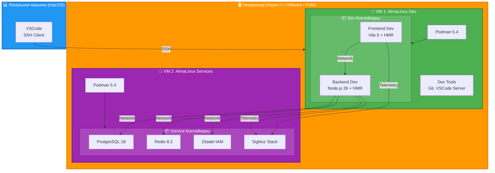
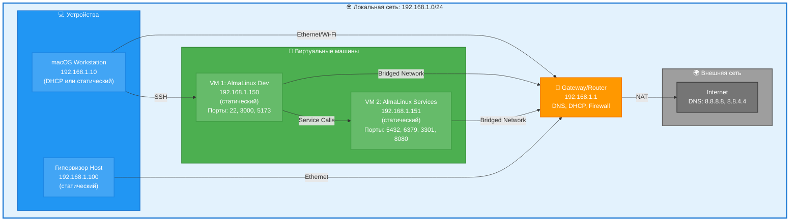

[← Оглавление курса](index.md)

---

# Глава 1. Организация аппаратной базы разработки

## 1.1. Обзор инфраструктуры курса

В этом курсе мы будем работать с современным стеком контейнерной разработки на базе AlmaLinux 9. Для эффективного обучения необходимо правильно организовать аппаратную базу и сетевую инфраструктуру.

**Архитектура обучающей среды:**



**Компоненты инфраструктуры:**

1. **Локальная машина (macOS)** — рабочая станция разработчика
2. **Гипервизор** — платформа виртуализации (Hyper-V, VMware ESXi, Proxmox VE, KVM/QEMU)
3. **VM 1: AlmaLinux Dev** — виртуальная машина для разработки приложений
4. **VM 2: AlmaLinux Services** — виртуальная машина для инфраструктурных сервисов
5. **Podman контейнеры** — изолированные сервисы приложения

**Преимущества разделения на 2 VM:**
- ✅ Изоляция разработки от сервисов
- ✅ Независимое масштабирование ресурсов
- ✅ Возможность перезагрузки dev VM без остановки сервисов
- ✅ Упрощенное управление backup'ами
- ✅ Лучшая безопасность через сегментацию

---

## 1.2. Требования к аппаратному обеспечению

### Локальная машина (macOS)

**Минимальные требования:**
- **CPU:** Intel Core i5 или Apple M1
- **RAM:** 8 GB
- **Диск:** 256 GB SSD
- **ОС:** macOS 14+ (Sonoma)
- **Сеть:** Ethernet или Wi-Fi

**Рекомендуемые требования:**
- **CPU:** Intel Core i7/i9 или Apple M2/M3
- **RAM:** 16 GB
- **Диск:** 512 GB SSD
- **ОС:** macOS 15+ (Sequoia)
- **Сеть:** Gigabit Ethernet

**Установленное ПО:**
- VSCode с расширениями Remote-SSH и Dev Containers
- SSH клиент (встроен в macOS)
- Git (встроен в macOS)

---

### Сервер виртуализации (Гипервизор)

**Поддерживаемые платформы:**
- **Hyper-V** (Windows Server 2022/2025, Windows 10/11 Pro)
- **VMware** (ESXi 8.0, Workstation Pro 17, Fusion 13)
- **Proxmox VE** (8.0+) — open-source на базе KVM
- **KVM/QEMU** (с libvirt) — Linux гипервизор
- **VirtualBox** (7.0+) — для базового обучения

**Минимальные требования:**
- **CPU:** 4 ядра с поддержкой виртуализации (Intel VT-x/AMD-V)
- **RAM:** 16 GB (для 2 VM с минимальной конфигурацией)
- **Диск:** 500 GB SSD
- **Сеть:** Gigabit Ethernet

**Рекомендуемые требования:**
- **CPU:** 8+ ядер с поддержкой виртуализации
- **RAM:** 32 GB или более (для 2 VM с полным стеком)
- **Диск:** 1 TB NVMe SSD
- **Сеть:** 10 Gigabit Ethernet или 2x Gigabit (bonding)

**Оптимальные требования:**
- **CPU:** 16+ ядер (для production-like среды)
- **RAM:** 64 GB или более
- **Диск:** 2 TB NVMe SSD (RAID 1 для надежности)
- **Сеть:** 10 Gigabit Ethernet с резервированием

---

### VM 1: AlmaLinux Dev (Разработка)

**Минимальная конфигурация:**
- **vCPU:** 2 ядра
- **RAM:** 2 GB
- **Диск:** 30 GB (thin provisioning)
- **Сеть:** 1 виртуальный адаптер (Bridged)

**Рекомендуемая конфигурация:**
- **vCPU:** 4 ядра
- **RAM:** 4 GB
- **Диск:** 50 GB (thin provisioning)
- **Сеть:** 1 виртуальный адаптер (Bridged)

**Оптимальная конфигурация:**
- **vCPU:** 6 ядер
- **RAM:** 8 GB
- **Диск:** 80 GB (thin provisioning)
- **Сеть:** 1 виртуальный адаптер (Bridged)

---

### VM 2: AlmaLinux Services (Сервисы)

**Минимальная конфигурация:**
- **vCPU:** 2 ядра
- **RAM:** 4 GB
- **Диск:** 50 GB (thin provisioning)
- **Сеть:** 1 виртуальный адаптер (Bridged)

**Рекомендуемая конфигурация:**
- **vCPU:** 4 ядра
- **RAM:** 8 GB
- **Диск:** 100 GB (thin provisioning)
- **Сеть:** 1 виртуальный адаптер (Bridged)

**Оптимальная конфигурация:**
- **vCPU:** 8 ядер
- **RAM:** 16 GB
- **Диск:** 150 GB (thin provisioning)
- **Сеть:** 1 виртуальный адаптер (Bridged)

**Общие настройки VM:**
- **Firmware:** UEFI (рекомендуется) или BIOS
- **Secure Boot:** Включен (рекомендуется для безопасности, AlmaLinux 9 поддерживает Secure Boot)
- **Disk Type:** SCSI или VirtIO (для лучшей производительности)
- **Network Type:** VirtIO-Net или VMXNET3 (для лучшей производительности)

> **Примечание о Secure Boot:** AlmaLinux 9 полностью поддерживает UEFI Secure Boot. Если при установке возникают проблемы с загрузкой, можно временно отключить Secure Boot, но после установки рекомендуется включить его обратно для повышения безопасности.

---

## 1.3. Сетевая архитектура

### Схема сетевой адресации



**Таблица адресации:**

| Устройство | IP адрес | Тип | Назначение |
|------------|----------|-----|------------|
| Gateway/Router | 192.168.1.1 | Статический | Шлюз, DNS, DHCP |
| macOS Workstation | 192.168.1.10 | DHCP/Статический | Рабочая станция |
| Гипервизор Host | 192.168.1.100 | Статический | Сервер виртуализации |
| VM 1: AlmaLinux Dev | 192.168.1.150 | Статический | Разработка |
| VM 2: AlmaLinux Services | 192.168.1.151 | Статический | Сервисы |

**DNS серверы:**
- Первичный: 192.168.1.1 (локальный router)
- Вторичный: 8.8.8.8 (Google DNS)
- Резервный: 8.8.4.4 (Google DNS)

### Настройка статического IP на AlmaLinux VM

**VM 1: AlmaLinux Dev (192.168.1.150):**

```bash
# Просмотр сетевых интерфейсов
ip addr show

# Определение имени подключения
nmcli connection show

# Настройка статического IP (замените "System eth0" на ваше подключение)
sudo nmcli connection modify "System eth0" \
  ipv4.addresses 192.168.1.150/24 \
  ipv4.gateway 192.168.1.1 \
  ipv4.dns "192.168.1.1 8.8.8.8 8.8.4.4" \
  ipv4.method manual

# Применение изменений
sudo nmcli connection up "System eth0"

# Проверка
ip addr show
ping -c 4 8.8.8.8
ping -c 4 google.com
```

**VM 2: AlmaLinux Services (192.168.1.151):**

```bash
# Аналогично, но с другим IP
sudo nmcli connection modify "System eth0" \
  ipv4.addresses 192.168.1.151/24 \
  ipv4.gateway 192.168.1.1 \
  ipv4.dns "192.168.1.1 8.8.8.8 8.8.4.4" \
  ipv4.method manual

sudo nmcli connection up "System eth0"

# Проверка связи между VM
ping -c 4 192.168.1.150  # Ping Dev VM
```

### Порты и сервисы

**VM 1: AlmaLinux Dev (192.168.1.150):**

| Порт | Сервис | Описание |
|------|--------|----------|
| 22 | SSH | Удаленный доступ |
| 3000 | Backend Dev | Node.js/Fastify dev server |
| 5173 | Frontend Dev | Vite dev server с HMR |
| 8080 | Frontend Prod | Nginx (production build) |
| 9090 | Cockpit | Веб-интерфейс управления |

**VM 2: AlmaLinux Services (192.168.1.151):**

| Порт | Сервис | Описание |
|------|--------|----------|
| 22 | SSH | Удаленный доступ |
| 5432 | PostgreSQL | База данных |
| 6379 | Redis | Кэш и сессии |
| 3301 | SigNoz UI | Мониторинг интерфейс |
| 4317 | OTel gRPC | OpenTelemetry Collector |
| 4318 | OTel HTTP | OpenTelemetry Collector |
| 8080 | Zitadel | IAM сервис |
| 9090 | Cockpit | Веб-интерфейс управления |

**Настройка firewall на VM 1 (Dev):**

```bash
# SSH (уже открыт по умолчанию)
sudo firewall-cmd --permanent --add-service=ssh

# Backend Dev
sudo firewall-cmd --permanent --add-port=3000/tcp

# Frontend Dev и Prod
sudo firewall-cmd --permanent --add-port=5173/tcp
sudo firewall-cmd --permanent --add-port=8080/tcp

# Cockpit
sudo firewall-cmd --permanent --add-service=cockpit

# Применить изменения
sudo firewall-cmd --reload

# Проверка
sudo firewall-cmd --list-all
```

**Настройка firewall на VM 2 (Services):**

```bash
# SSH
sudo firewall-cmd --permanent --add-service=ssh

# PostgreSQL
sudo firewall-cmd --permanent --add-port=5432/tcp

# Redis
sudo firewall-cmd --permanent --add-port=6379/tcp

# SigNoz
sudo firewall-cmd --permanent --add-port=3301/tcp
sudo firewall-cmd --permanent --add-port=4317/tcp
sudo firewall-cmd --permanent --add-port=4318/tcp

# Zitadel
sudo firewall-cmd --permanent --add-port=8080/tcp

# Cockpit
sudo firewall-cmd --permanent --add-service=cockpit

# Применить изменения
sudo firewall-cmd --reload

# Проверка
sudo firewall-cmd --list-all
```

---

## 1.4. Распределение ресурсов по сервисам

### Минимальная конфигурация (4 GB RAM)

**Для обучения базовым концепциям:**

| Сервис | CPU | RAM | Диск | Примечание |
|--------|-----|-----|------|------------|
| AlmaLinux OS | 0.5 | 512 MB | 10 GB | Базовая система |
| Backend (Node.js) | 0.5 | 512 MB | 5 GB | Один экземпляр |
| Frontend (Vite dev) | 0.5 | 512 MB | 5 GB | Dev server |
| PostgreSQL | 0.25 | 512 MB | 10 GB | Минимальная конфигурация |
| Redis | 0.25 | 256 MB | 2 GB | Кэш |
| **Итого** | **2** | **~2.3 GB** | **32 GB** | Базовый стек |

**Ограничения:**
- ❌ Нельзя запустить SigNoz (требует 2+ GB RAM)
- ❌ Нельзя запустить Zitadel одновременно с другими сервисами
- ⚠️ Медленная работа при одновременном запуске всех сервисов
- ✅ Подходит для изучения отдельных компонентов

---

### Рекомендуемая конфигурация (8 GB RAM)

**Для комфортной разработки:**

| Сервис | CPU | RAM | Диск | Примечание |
|--------|-----|-----|------|------------|
| AlmaLinux OS | 1 | 1 GB | 15 GB | Система + утилиты |
| Backend (Node.js) | 1 | 1 GB | 10 GB | С hot reload |
| Frontend (Vite dev) | 1 | 1 GB | 10 GB | Dev server |
| PostgreSQL | 0.5 | 1 GB | 15 GB | Оптимизированная конфигурация |
| Redis | 0.5 | 512 MB | 5 GB | Кэш и сессии |
| SigNoz Stack | 1 | 2 GB | 20 GB | Мониторинг (опционально) |
| Zitadel | 0.5 | 512 MB | 5 GB | IAM (опционально) |
| **Итого** | **4** | **~7 GB** | **80 GB** | Полный стек |

**Возможности:**
- ✅ Все сервисы курса одновременно
- ✅ Комфортная разработка
- ✅ Мониторинг через SigNoz
- ✅ Аутентификация через Zitadel
- ⚠️ Может быть медленно при активной работе всех сервисов

---

### Оптимальная конфигурация (16 GB RAM)

**Для production-like среды:**

| Сервис | CPU | RAM | Диск | Примечание |
|--------|-----|-----|------|------------|
| AlmaLinux OS | 2 | 2 GB | 20 GB | Полная система |
| Backend (Node.js) | 2 | 2 GB | 15 GB | Несколько экземпляров |
| Frontend (Nginx) | 1 | 512 MB | 10 GB | Production build |
| PostgreSQL | 1 | 2 GB | 30 GB | Production конфигурация |
| Redis | 1 | 1 GB | 10 GB | Персистентность |
| SigNoz Stack | 2 | 4 GB | 30 GB | Полный мониторинг |
| Zitadel + DB | 1 | 1.5 GB | 10 GB | IAM с PostgreSQL |
| Резерв | - | 3 GB | 15 GB | Для экспериментов |
| **Итого** | **8** | **~16 GB** | **140 GB** | Production-ready |

**Возможности:**
- ✅ Все сервисы с запасом ресурсов
- ✅ Быстрая работа всех компонентов
- ✅ Возможность масштабирования
- ✅ Тестирование production сценариев
- ✅ Параллельная работа нескольких проектов

---

## 1.5. Создание AlmaLinux VM

### Подготовка

**Скачивание ISO образа:**

```bash
# URL для скачивания
https://repo.almalinux.org/almalinux/9.6/isos/x86_64/AlmaLinux-9.6-x86_64-minimal.iso

# Или через командную строку
wget https://repo.almalinux.org/almalinux/9.6/isos/x86_64/AlmaLinux-9.6-x86_64-minimal.iso
```

### Создание VM (универсальные шаги)

**Параметры для VM 1 (Dev):**
- Имя: `AlmaLinux-Dev`
- vCPU: 4 ядра
- RAM: 4-8 GB
- Диск: 50-80 GB (thin provisioning)
- Сеть: Bridged (доступ к локальной сети)
- Firmware: UEFI с Secure Boot (рекомендуется)

**Параметры для VM 2 (Services):**
- Имя: `AlmaLinux-Services`
- vCPU: 4 ядра
- RAM: 8-16 GB
- Диск: 100-150 GB (thin provisioning)
- Сеть: Bridged (доступ к локальной сети)
- Firmware: UEFI с Secure Boot (рекомендуется)

**Создание VM в разных гипервизорах:**

<details>
<summary><b>Hyper-V (Windows)</b></summary>

```powershell
# Создание VM 1 (Dev)
New-VM -Name "AlmaLinux-Dev" `
    -MemoryStartupBytes 8GB `
    -Generation 2 `
    -NewVHDPath "C:\VMs\AlmaLinux-Dev\disk.vhdx" `
    -NewVHDSizeBytes 80GB `
    -SwitchName "External Switch"

Set-VMProcessor -VMName "AlmaLinux-Dev" -Count 4

# Secure Boot включен по умолчанию для Generation 2 VM
# Используем шаблон Microsoft UEFI Certificate Authority для Linux
Set-VMFirmware -VMName "AlmaLinux-Dev" -SecureBootTemplate "MicrosoftUEFICertificateAuthority"

# Если возникают проблемы с загрузкой, можно временно отключить:
# Set-VMFirmware -VMName "AlmaLinux-Dev" -EnableSecureBoot Off
```
</details>

<details>
<summary><b>VMware ESXi / Workstation</b></summary>

1. New Virtual Machine → Custom
2. Hardware Version: Latest
3. Guest OS: Linux → Other Linux 5.x or later kernel 64-bit
4. CPU: 4 cores
5. Memory: 8 GB
6. Network: Bridged
7. Disk: 80 GB, Thin Provision
</details>

<details>
<summary><b>Proxmox VE</b></summary>

```bash
# Через веб-интерфейс или CLI
qm create 100 --name AlmaLinux-Dev --memory 8192 --cores 4 --net0 virtio,bridge=vmbr0
qm importdisk 100 /var/lib/vz/template/iso/AlmaLinux-9.6.iso local-lvm
qm set 100 --scsihw virtio-scsi-pci --scsi0 local-lvm:vm-100-disk-0
qm set 100 --boot c --bootdisk scsi0
qm set 100 --ostype l26
```
</details>

<details>
<summary><b>KVM/QEMU (libvirt)</b></summary>

```bash
virt-install \
  --name AlmaLinux-Dev \
  --ram 8192 \
  --vcpus 4 \
  --disk path=/var/lib/libvirt/images/almalinux-dev.qcow2,size=80 \
  --os-variant almalinux9 \
  --network bridge=br0 \
  --graphics vnc \
  --cdrom /var/lib/libvirt/images/AlmaLinux-9.6-x86_64-minimal.iso
```
</details>

### Установка AlmaLinux

**Процесс установки (одинаков для обеих VM):**

1. **Загрузка с ISO** — VM загрузится с установочного образа
2. **Выбор языка** — English (рекомендуется для курса)
3. **Installation Destination** — выберите диск, автоматическое разбиение
4. **Network & Host Name:**
   - Включите сетевой адаптер
   - Hostname: `almalinux-dev.local` (для VM1) или `almalinux-services.local` (для VM2)
   - Configure: установите статический IP (192.168.1.150 или 192.168.1.151)
5. **Root Password** — установите надежный пароль
6. **User Creation** — создайте пользователя `developer` с sudo правами
7. **Software Selection** — Minimal Install
8. **Begin Installation** — дождитесь завершения
9. **Reboot** — перезагрузите VM

### Проверка Secure Boot (опционально)

**После установки проверьте статус Secure Boot:**

```bash
# Проверка статуса Secure Boot
sudo mokutil --sb-state
# Вывод: SecureBoot enabled (если включен)
# Или: SecureBoot disabled (если отключен)

# Альтернативный способ проверки
dmesg | grep -i "secure boot"
```

**Преимущества Secure Boot:**
- ✅ Защита от буткитов и руткитов
- ✅ Проверка подписи загрузчика и ядра
- ✅ Предотвращение загрузки неподписанного кода
- ✅ Соответствие корпоративным стандартам безопасности

**Когда можно отключить Secure Boot:**
- ⚠️ Использование кастомных ядер без подписи
- ⚠️ Тестирование драйверов в разработке
- ⚠️ Совместимость со старым оборудованием

> **Рекомендация:** Для production-окружений всегда держите Secure Boot включенным.

### Первичная настройка после установки

**Выполните на обеих VM:**

```bash
# Войдите как root или developer

# Обновление системы
sudo dnf update -y

# Установка базовых инструментов
sudo dnf install -y \
  nano \
  git \
  curl \
  wget \
  htop \
  net-tools \
  bind-utils \
  tar \
  unzip

# Настройка hostname (для VM1)
sudo hostnamectl set-hostname almalinux-dev.local

# Или для VM2
sudo hostnamectl set-hostname almalinux-services.local

# Проверка сети
ip addr show
ping -c 4 8.8.8.8
ping -c 4 google.com

# Настройка firewall
sudo systemctl enable --now firewalld
sudo firewall-cmd --permanent --add-service=ssh
sudo firewall-cmd --permanent --add-service=cockpit
sudo firewall-cmd --reload

# Установка Cockpit (веб-интерфейс)
sudo dnf install -y cockpit
sudo systemctl enable --now cockpit.socket

# Проверка доступа к Cockpit
# VM1: https://192.168.1.150:9090
# VM2: https://192.168.1.151:9090
```

---

## 1.6. Мониторинг ресурсов

### Утилиты мониторинга

```bash
# Установка инструментов мониторинга
sudo dnf install -y htop iotop nethogs ncdu

# Просмотр использования CPU и RAM
htop

# Просмотр дисковой активности
iotop

# Просмотр сетевой активности
nethogs

# Анализ использования диска
ncdu /
```

### Мониторинг через Cockpit

1. Откройте Cockpit: `https://192.168.1.150:9090`
2. Войдите с учетными данными пользователя
3. Просмотр метрик:
   - **Overview** — общая информация о системе
   - **Logs** — системные логи
   - **Storage** — использование дисков
   - **Networking** — сетевая активность
   - **Podman Containers** — контейнеры (после установки Podman)

---

## 1.7. Troubleshooting

### Проблемы с производительностью

**Симптомы:**
- Медленная работа VM
- Высокая загрузка CPU/RAM
- Долгая загрузка приложений

**Решения:**

```bash
# 1. Проверка использования ресурсов
htop
podman stats

# 2. Остановка ненужных сервисов
podman stop $(podman ps -q)

# 3. Очистка неиспользуемых ресурсов
podman system prune -a --volumes

# 4. Проверка swap
free -h
# Если swap активно используется - нужно больше RAM

# 5. Увеличение ресурсов VM (на Hyper-V Host)
# PowerShell:
# Stop-VM -Name "AlmaLinux-Dev"
# Set-VMMemory -VMName "AlmaLinux-Dev" -StartupBytes 16GB
# Set-VMProcessor -VMName "AlmaLinux-Dev" -Count 8
# Start-VM -Name "AlmaLinux-Dev"
```

### Проблемы с сетью

```bash
# Проверка сетевого подключения
ping -c 4 8.8.8.8
ping -c 4 google.com

# Проверка DNS
nslookup google.com

# Перезапуск сети
sudo systemctl restart NetworkManager

# Проверка firewall
sudo firewall-cmd --list-all

# Проверка маршрутизации
ip route show
```

### Проблемы с дисковым пространством

```bash
# Проверка использования диска
df -h

# Поиск больших файлов
sudo du -h / | sort -rh | head -20

# Очистка журналов
sudo journalctl --vacuum-time=7d

# Очистка кэша DNF
sudo dnf clean all

# Очистка Podman
podman system prune -a --volumes
```

---

## Практическое задание

**Задание 1: Создание VM**
1. Скачайте AlmaLinux 9.6 ISO
2. Создайте VM в Hyper-V с рекомендуемыми параметрами
3. Установите AlmaLinux с минимальной конфигурацией
4. Настройте статический IP адрес

**Задание 2: Первичная настройка**
1. Обновите систему
2. Установите базовые инструменты
3. Настройте firewall
4. Установите и настройте Cockpit

**Задание 3: Мониторинг**
1. Установите htop, iotop, nethogs
2. Откройте Cockpit в браузере
3. Проверьте использование ресурсов
4. Создайте snapshot VM

**Задание 4: Сеть**
1. Проверьте сетевое подключение
2. Настройте SSH доступ с локальной машины
3. Откройте необходимые порты в firewall
4. Проверьте доступность портов с локальной машины

## Проверка знаний

```bash
# 1. Проверка ресурсов VM
free -h
nproc
df -h

# 2. Проверка сети
ip addr show
ping -c 4 8.8.8.8

# 3. Проверка firewall
sudo firewall-cmd --list-all

# 4. Проверка сервисов
systemctl status sshd
systemctl status cockpit.socket

# 5. Проверка hostname
hostnamectl
```


