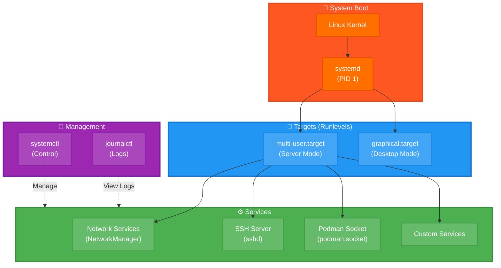
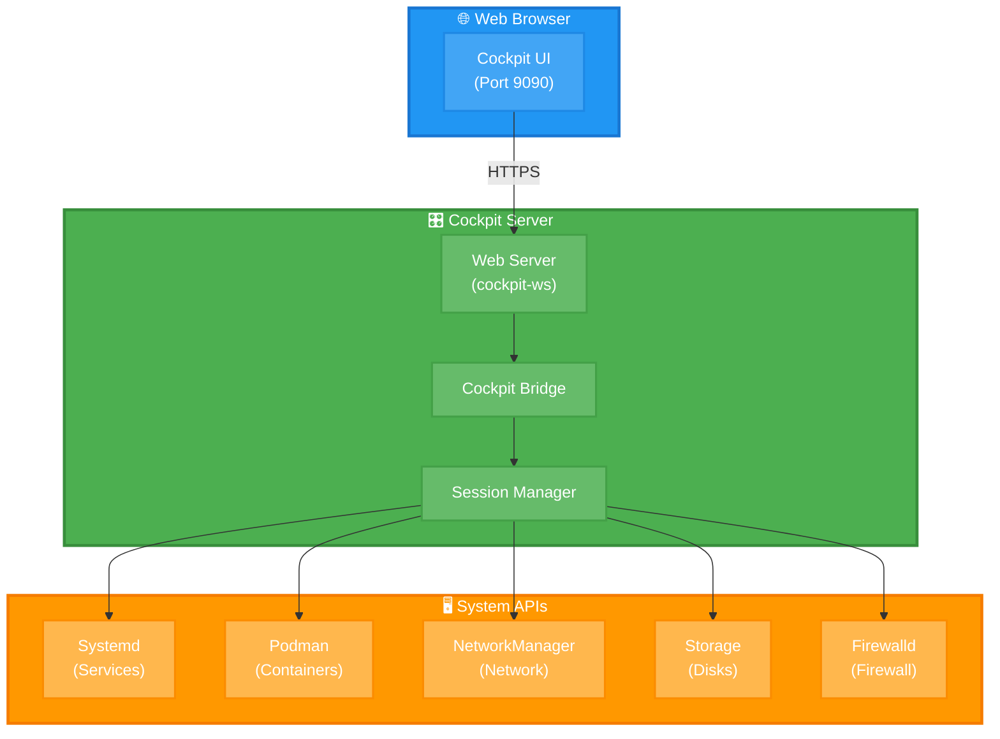

[← Оглавление курса](index.md)


# Глава 2. AlmaLinux и основы системы

## 2.1. Что такое AlmaLinux

**AlmaLinux** — enterprise-ready дистрибутив Linux, созданный как замена CentOS после его перехода на модель CentOS Stream.

**Ключевые характеристики:**
- **Бинарная совместимость** с Red Hat Enterprise Linux (RHEL)
- **Долгосрочная поддержка** — 10 лет для каждого мажорного релиза
- **Стабильность** — фокус на production-окружения
- **Бесплатность** — полностью open-source
- **Сообщество** — поддержка CloudLinux и крупных компаний

**Где применяется:**
- Enterprise-серверы и дата-центры
- Облачные платформы (AWS, Azure, GCP)
- Контейнерные платформы
- CI/CD инфраструктура
- Production-окружения с высокими требованиями к стабильности

**Почему в этом курсе:**
- Стабильная база для production
- Отличная поддержка Podman
- Долгосрочная поддержка
- Совместимость с RHEL-экосистемой

**Распространенность:**
- Топ-5 серверных дистрибутивов Linux
- Активно используется в enterprise-сегменте
- Растущее сообщество после ухода CentOS

**Актуальная версия:** AlmaLinux 9.6 (на момент написания курса)

**Ссылки:**
- Официальный сайт: https://almalinux.org/
- GitHub: https://github.com/AlmaLinux
- Документация: https://wiki.almalinux.org/
- ISO образы: https://mirrors.almalinux.org/isos.html


## 2.2. Установка и первичная настройка

### Установка AlmaLinux 9.6

**Системные требования:**
- CPU: 2+ ядра (рекомендуется 4)
- RAM: 4 GB минимум (рекомендуется 8 GB)
- Диск: 20 GB минимум (рекомендуется 50+ GB)
- Сеть: Ethernet или Wi-Fi

**Скачивание ISO:**

```bash
# Minimal ISO (рекомендуется для серверов)
wget https://repo.almalinux.org/almalinux/9.6/isos/x86_64/AlmaLinux-9.6-x86_64-minimal.iso
```

**После установки — первичная настройка:**

```bash
# Обновление системы до последних пакетов
sudo dnf update -y

# Установка базовых инструментов
sudo dnf install -y \
  nano \
  mc \
  htop \
  git \
  curl \
  wget \
  tar \
  unzip \
  net-tools \
  bind-utils

# Проверка версии системы
cat /etc/almalinux-release
# Вывод: AlmaLinux release 9.6 (Seafoam Ocelot)

# Проверка ядра
uname -r
# Вывод: 5.14.0-503.el9.x86_64
```

### Настройка hostname

```bash
# Установка имени хоста
sudo hostnamectl set-hostname almalinux-dev.local

# Проверка
hostnamectl
```

### Настройка часового пояса

```bash
# Список доступных зон
timedatectl list-timezones | grep Moscow

# Установка часового пояса
sudo timedatectl set-timezone Europe/Moscow

# Проверка
timedatectl
```

### Настройка локали

```bash
# Установка русской локали
sudo dnf install -y glibc-langpack-ru

# Установка локали
sudo localectl set-locale LANG=ru_RU.UTF-8

# Проверка
localectl
```


## 2.3. Управление пакетами через DNF

**DNF (Dandified YUM)** — современный пакетный менеджер для RHEL-based систем.

**Почему DNF:**
- Быстрее и эффективнее старого YUM
- Лучшее разрешение зависимостей
- Встроенная поддержка модулей
- Автоматическая очистка кэша

**Основные команды:**

```bash
# Обновление списка пакетов
sudo dnf check-update

# Обновление всех пакетов
sudo dnf update -y

# Поиск пакета
dnf search nginx

# Информация о пакете
dnf info nginx

# Установка пакета
sudo dnf install -y nginx

# Удаление пакета
sudo dnf remove nginx

# Список установленных пакетов
dnf list installed

# Очистка кэша
sudo dnf clean all
```

### Работа с репозиториями

```bash
# Список активных репозиториев
dnf repolist

# Добавление EPEL (Extra Packages for Enterprise Linux)
sudo dnf install -y epel-release

# Проверка добавленного репозитория
dnf repolist | grep epel
```

### Работа с модулями

```bash
# Список доступных модулей
dnf module list

# Информация о модуле
dnf module info nodejs

# Установка конкретной версии через модуль
sudo dnf module install nodejs:20/common
```


## 2.4. Firewalld и сетевая безопасность

**Firewalld** — динамический файрвол для Linux, используется по умолчанию в AlmaLinux.

**Почему Firewalld:**
- Динамическое управление правилами без перезагрузки
- Зоны для разных уровней доверия
- Интеграция с systemd
- Поддержка IPv4 и IPv6

**Проверка статуса:**

```bash
# Firewalld включен по умолчанию в AlmaLinux 9
sudo systemctl status firewalld

# Если не запущен (обычно не требуется)
sudo systemctl start firewalld
sudo systemctl enable firewalld
```

**Основные команды:**

```bash
# Текущая зона по умолчанию
sudo firewall-cmd --get-default-zone
# Вывод: public

# Список активных зон
sudo firewall-cmd --get-active-zones

# Список разрешенных сервисов
sudo firewall-cmd --list-all

# Разрешить HTTP
sudo firewall-cmd --permanent --add-service=http

# Разрешить HTTPS
sudo firewall-cmd --permanent --add-service=https

# Разрешить конкретный порт
sudo firewall-cmd --permanent --add-port=3000/tcp

# Применить изменения
sudo firewall-cmd --reload

# Проверка правил
sudo firewall-cmd --list-all
```

**Практика: открытие портов для нашего стека:**

```bash
# PostgreSQL
sudo firewall-cmd --permanent --add-port=5432/tcp

# Node.js API
sudo firewall-cmd --permanent --add-port=3001/tcp

# Vite dev server
sudo firewall-cmd --permanent --add-port=5173/tcp

# SigNoz
sudo firewall-cmd --permanent --add-port=3301/tcp

# Zitadel
sudo firewall-cmd --permanent --add-port=8080/tcp

# Применить все изменения
sudo firewall-cmd --reload

# Проверка
sudo firewall-cmd --list-ports
```


## 2.5. Systemd: управление сервисами

**Systemd** — система инициализации и управления сервисами в современных Linux-дистрибутивах.

**Архитектура Systemd:**



**Почему Systemd:**
- Параллельный запуск сервисов (быстрая загрузка)
- Управление зависимостями
- Мониторинг и логирование
- Стандарт для большинства дистрибутивов

**Основные команды:**

```bash
# Статус сервиса
sudo systemctl status nginx

# Запуск сервиса
sudo systemctl start nginx

# Остановка сервиса
sudo systemctl stop nginx

# Перезапуск сервиса
sudo systemctl restart nginx

# Перезагрузка конфигурации без остановки
sudo systemctl reload nginx

# Автозапуск при загрузке системы
sudo systemctl enable nginx

# Отключение автозапуска
sudo systemctl disable nginx

# Список всех сервисов
systemctl list-units --type=service

# Список запущенных сервисов
systemctl list-units --type=service --state=running
```

**Просмотр логов через journalctl:**

```bash
# Логи конкретного сервиса
sudo journalctl -u nginx

# Последние 50 строк
sudo journalctl -u nginx -n 50

# Логи в реальном времени
sudo journalctl -u nginx -f

# Логи за сегодня
sudo journalctl -u nginx --since today

# Логи за последний час
sudo journalctl -u nginx --since "1 hour ago"
```

**Создание собственного systemd-сервиса (пример):**

```bash
# Создание файла сервиса
sudo nano /etc/systemd/system/myapp.service
```

Содержимое:

```ini
[Unit]
Description=My Node.js Application
After=network.target

[Service]
Type=simple
User=developer
WorkingDirectory=/home/developer/myapp
ExecStart=/usr/bin/node server.js
Restart=on-failure
RestartSec=10

[Install]
WantedBy=multi-user.target
```

Активация:

```bash
# Перезагрузка конфигурации systemd
sudo systemctl daemon-reload

# Запуск сервиса
sudo systemctl start myapp

# Автозапуск
sudo systemctl enable myapp

# Проверка статуса
sudo systemctl status myapp
```


## 2.6. Cockpit: веб-интерфейс для управления сервером

**Cockpit** — современный веб-интерфейс для администрирования Linux серверов.

**Архитектура Cockpit:**



**Ключевые возможности:**
- **Управление сервисами** — запуск, остановка, мониторинг
- **Мониторинг ресурсов** — CPU, RAM, диски, сеть
- **Управление контейнерами** — интеграция с Podman
- **Сетевые настройки** — конфигурация сети и firewall
- **Управление пользователями** — создание, удаление, права
- **Терминал** — встроенный SSH терминал
- **Логи** — просмотр системных логов

**Почему Cockpit:**
- Простой и интуитивный интерфейс
- Не требует агентов или демонов
- Минимальное потребление ресурсов
- Безопасное подключение через HTTPS
- Мультисерверное управление
- Расширяемость через плагины

### 2.6.1. Установка Cockpit

```bash
# Установка Cockpit и дополнительных модулей
sudo dnf install -y \
  cockpit \
  cockpit-podman \
  cockpit-storaged \
  cockpit-networkmanager \
  cockpit-packagekit

# Запуск и автозапуск Cockpit
sudo systemctl enable --now cockpit.socket

# Проверка статуса
sudo systemctl status cockpit.socket
```

### 2.6.2. Настройка Firewall для Cockpit

```bash
# Открытие порта 9090 для Cockpit
sudo firewall-cmd --permanent --add-service=cockpit
sudo firewall-cmd --reload

# Проверка
sudo firewall-cmd --list-services | grep cockpit
```

### 2.6.3. Доступ к Cockpit

**Через браузер:**

```
https://server-ip:9090
```

**Вход:**
- Используйте учетные данные пользователя Linux
- Для административных задач нужен пользователь с sudo правами

**Первый вход:**

1. Откройте браузер и перейдите на `https://your-server-ip:9090`
2. Примите самоподписанный сертификат (или настройте Let's Encrypt)
3. Введите имя пользователя и пароль
4. Отметьте "Reuse my password for privileged tasks" для sudo

### 2.6.4. Основные возможности Cockpit

**Dashboard (Главная страница):**
- Обзор системы (CPU, RAM, Network, Disk)
- Статус сервисов
- Системная информация
- Обновления системы

**System (Система):**

```bash
# Просмотр информации о системе
- Hostname
- Operating System
- Kernel version
- Hardware information
- Performance profiles
```

**Logs (Логи):**

```bash
# Просмотр системных логов
- Фильтрация по времени
- Фильтрация по приоритету (error, warning, info)
- Поиск по тексту
- Экспорт логов
```

**Storage (Хранилище):**

```bash
# Управление дисками и файловыми системами
- Просмотр дисков и разделов
- Создание и удаление разделов
- Монтирование файловых систем
- RAID конфигурация
- LVM управление
```

**Networking (Сеть):**

```bash
# Управление сетевыми интерфейсами
- Настройка IP адресов
- Конфигурация DNS
- Управление маршрутами
- Firewall правила
- Bonding и bridging
```

**Accounts (Учетные записи):**

```bash
# Управление пользователями
- Создание пользователей
- Изменение паролей
- Управление группами
- SSH ключи
- Sudo права
```

**Services (Сервисы):**

```bash
# Управление systemd сервисами
- Список всех сервисов
- Запуск/остановка сервисов
- Enable/disable автозапуска
- Просмотр логов сервиса
- Редактирование unit файлов
```

**Podman Containers (Контейнеры):**

```bash
# Управление Podman контейнерами
- Список контейнеров и образов
- Запуск/остановка контейнеров
- Создание контейнеров из образов
- Просмотр логов контейнеров
- Статистика использования ресурсов
- Pull/Push образов
```

**Terminal (Терминал):**

```bash
# Встроенный SSH терминал
- Полноценный bash терминал
- Копирование/вставка
- Поддержка цветов
- История команд
```

### 2.6.5. Настройка SSL сертификата

**Использование самоподписанного сертификата (по умолчанию):**

```bash
# Cockpit автоматически создает самоподписанный сертификат
# Расположение: /etc/cockpit/ws-certs.d/
ls -la /etc/cockpit/ws-certs.d/
```

**Настройка Let's Encrypt сертификата:**

```bash
# Установка certbot
sudo dnf install -y certbot

# Получение сертификата
sudo certbot certonly --standalone -d your-domain.com

# Создание симлинка для Cockpit
sudo ln -sf /etc/letsencrypt/live/your-domain.com/fullchain.pem \
  /etc/cockpit/ws-certs.d/1-my-cert.cert
sudo ln -sf /etc/letsencrypt/live/your-domain.com/privkey.pem \
  /etc/cockpit/ws-certs.d/1-my-cert.key

# Перезапуск Cockpit
sudo systemctl restart cockpit.socket
```

### 2.6.6. Управление несколькими серверами

Cockpit позволяет управлять несколькими серверами из одного интерфейса.

**Добавление сервера:**

1. В Cockpit UI нажмите на имя хоста в верхнем левом углу
2. Нажмите "Add new host"
3. Введите IP адрес или hostname
4. Введите учетные данные
5. Нажмите "Add"

**Переключение между серверами:**

- Кликните на имя хоста в верхнем левом углу
- Выберите нужный сервер из списка

### 2.6.7. Мониторинг производительности

**Просмотр метрик в реальном времени:**

```bash
# CPU Usage
- Общая загрузка CPU
- Загрузка по ядрам
- Top процессы

# Memory Usage
- Использование RAM
- Swap usage
- Memory по процессам

# Disk I/O
- Чтение/запись
- I/O операции
- Использование дисков

# Network
- Входящий/исходящий трафик
- Пакеты в секунду
- Ошибки сети
```

**Настройка Performance Profile:**

```bash
# В Cockpit UI: System → Performance Profile
# Доступные профили:
- balanced (по умолчанию)
- throughput-performance (максимальная производительность)
- latency-performance (минимальная задержка)
- network-latency (оптимизация сети)
- powersave (энергосбережение)
```

### 2.6.8. Работа с Podman через Cockpit

**Управление контейнерами:**

1. Перейдите в раздел "Podman Containers"
2. Просмотр списка контейнеров и образов
3. Создание контейнера:
   - Нажмите "Create container"
   - Выберите образ или введите имя
   - Настройте порты, volumes, переменные окружения
   - Нажмите "Create"

**Мониторинг контейнеров:**

```bash
# Доступная информация:
- CPU usage
- Memory usage
- Network I/O
- Disk I/O
- Logs в реальном времени
```

### 2.6.9. Автоматизация через Cockpit API

Cockpit предоставляет REST API для автоматизации.

**Пример использования API:**

```bash
# Получение информации о системе
curl -k -u username:password \
  https://localhost:9090/cockpit/system/info

# Список сервисов
curl -k -u username:password \
  https://localhost:9090/cockpit/systemd/services

# Управление сервисом
curl -k -u username:password \
  -X POST \
  -H "Content-Type: application/json" \
  -d '{"action":"start"}' \
  https://localhost:9090/cockpit/systemd/service/nginx
```

### 2.6.10. Безопасность Cockpit

**Рекомендации по безопасности:**

```bash
# 1. Ограничение доступа по IP
sudo nano /etc/cockpit/cockpit.conf
```

Добавьте:

```ini
[WebService]
AllowUnencrypted = false
Origins = https://your-domain.com
```

```bash
# 2. Настройка firewall для конкретных IP
sudo firewall-cmd --permanent --add-rich-rule='
  rule family="ipv4"
  source address="192.168.1.0/24"
  service name="cockpit"
  accept'
sudo firewall-cmd --reload

# 3. Отключение root входа
sudo nano /etc/cockpit/disallowed-users
```

Добавьте:

```
root
```

```bash
# 4. Настройка timeout сессии
sudo nano /etc/cockpit/cockpit.conf
```

Добавьте:

```ini
[Session]
IdleTimeout = 15
```

**Аудит доступа:**

```bash
# Просмотр логов Cockpit
sudo journalctl -u cockpit.service -f

# Просмотр логов входа
sudo journalctl -u cockpit-ws -f
```


**Практическое задание:**

1. Обновите систему до последних пакетов
2. Установите EPEL репозиторий
3. Настройте firewall для портов 3000, 3001, 5432
4. Проверьте статус firewalld и systemd
5. Создайте тестовый systemd-сервис
6. Установите и настройте Cockpit
7. Откройте Cockpit в браузере и изучите интерфейс
8. Создайте тестовый контейнер через Cockpit UI
9. Настройте мониторинг ресурсов в Cockpit

**Проверка знаний:**

```bash
# Какая версия AlmaLinux установлена?
cat /etc/almalinux-release

# Какие порты открыты в firewall?
sudo firewall-cmd --list-ports

# Какие сервисы запущены?
systemctl list-units --type=service --state=running | head -20

# Работает ли Cockpit?
sudo systemctl status cockpit.socket

# Доступен ли Cockpit через браузер?
curl -k https://localhost:9090
```


