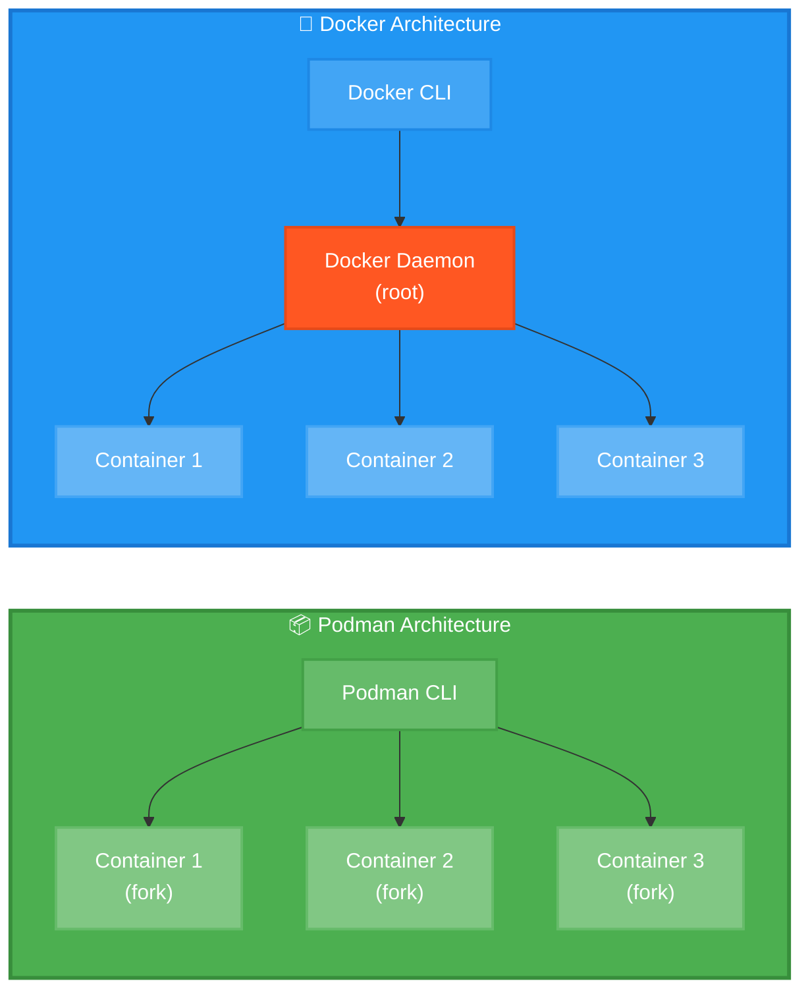

[← Оглавление курса](index.md)

---

# Глава 3. Podman: контейнеризация без Docker

## 3.1. Что такое Podman и чем он отличается от Docker

**Podman (Pod Manager)** — инструмент для управления контейнерами и образами, совместимый с OCI (Open Container Initiative).

**Ключевые характеристики:**
- **Daemonless** — не требует фонового процесса
- **Rootless** — запуск контейнеров без root-прав
- **Совместимость** — использует те же команды, что и Docker
- **Безопасность** — изоляция на уровне пользователя
- **Pods** — поддержка Kubernetes-подобных подов

**Отличия от Docker:**



| Характеристика | Podman | Docker |
|---|---|---|
| Архитектура | Daemonless (форк процесса) | Client-Server (daemon) |
| Root-права | Не требуются (rootless) | Требуются для daemon |
| Безопасность | Выше (изоляция пользователя) | Ниже (общий daemon) |
| Pods | Нативная поддержка | Требуется Kubernetes |
| Systemd | Встроенная интеграция | Требуется настройка |
| Совместимость | Docker CLI compatible | Стандарт де-факто |

**Где применяется:**
- Enterprise-окружения с высокими требованиями к безопасности
- RHEL/Fedora/AlmaLinux экосистема
- CI/CD пайплайны
- Development-окружения
- Production без Kubernetes

**Почему в этом курсе:**
- Стандарт для RHEL-based систем
- Лучшая безопасность через rootless
- Нативная интеграция с systemd
- Не требует привилегированного доступа
- Совместимость с Docker-образами

**Распространенность:**
- Стандарт в Red Hat экосистеме
- Растущее принятие в enterprise
- Поддержка всех major cloud providers
- Активное развитие и сообщество

**Актуальная версия:** Podman 5.4.0

**Ссылки:**
- Официальный сайт: https://podman.io/
- GitHub: https://github.com/containers/podman
- Документация: https://docs.podman.io/
- Podman Desktop: https://podman-desktop.io/

---

## 3.2. Установка Podman 5.4

**Podman включен в стандартные репозитории AlmaLinux 9.**

### Установка

```bash
# Установка EPEL репозитория (необходим для podman-compose)
sudo dnf install -y https://dl.fedoraproject.org/pub/epel/epel-release-latest-9.noarch.rpm

# Проверка доступной версии
dnf info podman

# Установка Podman и связанных инструментов
# podman - основной инструмент для управления контейнерами
# podman-compose - оркестрация multi-container приложений (аналог docker-compose)
# buildah - инструмент для сборки OCI-совместимых образов контейнеров
# skopeo - работа с образами (копирование, инспекция, удаление)
sudo dnf install -y \
  podman \
  podman-compose \
  buildah \
  skopeo
```

**Описание установленных пакетов:**

1. **podman** — основной инструмент для управления контейнерами и подами
   - Запуск, остановка, управление контейнерами
   - Работа с образами (pull, push, build)
   - Управление подами (группы контейнеров)
   - Совместимость с Docker CLI

2. **podman-compose** — оркестрация multi-container приложений
   - Чтение docker-compose.yml файлов
   - Запуск нескольких связанных контейнеров
   - Управление сетями и volumes
   - Альтернатива docker-compose

3. **buildah** — специализированный инструмент для сборки образов
   - Создание образов из Dockerfile
   - Создание образов из scratch
   - Модификация существующих образов
   - Более гибкий, чем `podman build`

4. **skopeo** — работа с образами без их загрузки
   - Копирование образов между registry
   - Инспекция образов удаленно
   - Удаление образов из registry
   - Синхронизация образов

**Проверка установки:**

```bash
# Проверка версий
podman --version
# Вывод: podman version 5.4.0

buildah --version
# Вывод: buildah version 1.35.0

skopeo --version
# Вывод: skopeo version 1.14.0

podman-compose --version
# Вывод: podman-compose version 1.0.6

# Информация о системе Podman
podman info
```

### Настройка rootless режима

```bash
# Проверка поддержки rootless
podman info | grep rootless
# Вывод: rootless: true

# Настройка subuid и subgid (обычно уже настроено)
grep $USER /etc/subuid
grep $USER /etc/subgid

# Если пусто, добавьте:
echo "$USER:100000:65536" | sudo tee -a /etc/subuid
echo "$USER:100000:65536" | sudo tee -a /etc/subgid

# Перелогиньтесь для применения изменений
```

### Настройка хранилища

```bash
# Создание директории для контейнеров
mkdir -p ~/.local/share/containers/storage

# Проверка конфигурации хранилища
podman info --format='{{.Store.GraphRoot}}'
# Вывод: /home/developer/.local/share/containers/storage
```

### Настройка registries

**Документация:** https://github.com/containers/image/blob/main/docs/containers-registries.conf.5.md

```bash
# Редактирование конфигурации registries
nano ~/.config/containers/registries.conf
```

Добавьте:

```toml
unqualified-search-registries = ["docker.io", "quay.io", "ghcr.io"]

[[registry]]
location = "docker.io"
insecure = false

[[registry]]
location = "quay.io"
insecure = false
```

---

## 3.3. Основные команды Podman

**Podman использует те же команды, что и Docker. Можно создать alias:**

```bash
# Добавьте в ~/.bashrc
echo "alias docker=podman" >> ~/.bashrc
source ~/.bashrc
```

### Работа с образами

```bash
# Поиск образа
podman search nginx

# Скачивание образа
podman pull docker.io/library/nginx:latest

# Список локальных образов
podman images

# Информация об образе
podman inspect nginx:latest

# Удаление образа
podman rmi nginx:latest

# Удаление неиспользуемых образов
podman image prune -a
```

### Работа с контейнерами

```bash
# Запуск контейнера
podman run -d --name mynginx -p 8080:80 nginx:latest

# Список запущенных контейнеров
podman ps

# Список всех контейнеров (включая остановленные)
podman ps -a

# Логи контейнера
podman logs mynginx

# Логи в реальном времени
podman logs -f mynginx

# Выполнение команды в контейнере
podman exec -it mynginx bash

# Остановка контейнера
podman stop mynginx

# Запуск остановленного контейнера
podman start mynginx

# Перезапуск контейнера
podman restart mynginx

# Удаление контейнера
podman rm mynginx

# Удаление с остановкой
podman rm -f mynginx
```

### Статистика и мониторинг

```bash
# Использование ресурсов
podman stats

# Информация о контейнере
podman inspect mynginx

# Процессы в контейнере
podman top mynginx

# События контейнера
podman events
```

---

## 3.4. Работа с образами и контейнерами

### Создание собственного образа

**Создание Dockerfile:**

```bash
# Создание директории проекта
mkdir ~/hello-podman && cd ~/hello-podman

# Создание простого Node.js приложения
nano server.js
```

Содержимое `server.js`:

```javascript
const http = require('http');

const server = http.createServer((req, res) => {
  res.writeHead(200, { 'Content-Type': 'text/plain' });
  res.end('Hello from Podman!\n');
});

server.listen(3000, () => {
  console.log('Server running on port 3000');
});
```

**Создание Dockerfile:**

```bash
nano Dockerfile
```

Содержимое:

```dockerfile
FROM docker.io/library/node:26-alpine

WORKDIR /app

COPY server.js .

EXPOSE 3000

CMD ["node", "server.js"]
```

**Сборка образа:**

```bash
# Сборка с тегом
podman build -t hello-podman:1.0 .

# Проверка созданного образа
podman images | grep hello-podman

# Запуск контейнера из образа
podman run -d --name hello -p 3000:3000 hello-podman:1.0

# Проверка работы
curl http://localhost:3000
# Вывод: Hello from Podman!

# Просмотр логов
podman logs hello
```

### Работа с volumes

```bash
# Создание volume
podman volume create mydata

# Список volumes
podman volume ls

# Информация о volume
podman volume inspect mydata

# Запуск контейнера с volume
podman run -d --name postgres \
  -v mydata:/var/lib/postgresql/data \
  -e POSTGRES_PASSWORD=secret \
  postgres:18-alpine

# Удаление volume
podman volume rm mydata

# Удаление неиспользуемых volumes
podman volume prune
```

### Работа с сетями

```bash
# Список сетей
podman network ls

# Создание сети
podman network create mynetwork

# Информация о сети
podman network inspect mynetwork

# Запуск контейнера в сети
podman run -d --name app --network mynetwork nginx

# Подключение контейнера к сети
podman network connect mynetwork hello

# Отключение от сети
podman network disconnect mynetwork hello

# Удаление сети
podman network rm mynetwork
```

---

## 3.5. Podman Compose: оркестрация контейнеров

**Podman Compose** — инструмент для управления multi-container приложениями, совместимый с Docker Compose.

### Установка

```bash
# Установка через DNF (уже установлено ранее)
sudo dnf install -y podman-compose

# Проверка версии
podman-compose --version
```

### Создание compose-файла

**Документация:** https://docs.podman.io/en/latest/markdown/podman-compose.1.html

```bash
# Создание проекта
mkdir ~/mystack && cd ~/mystack

# Создание docker-compose.yml
nano docker-compose.yml
```

Содержимое:

```yaml
version: '3.8'

services:
  web:
    image: nginx:alpine
    ports:
      - "8080:80"
    volumes:
      - ./html:/usr/share/nginx/html:ro
    networks:
      - frontend
    restart: unless-stopped

  api:
    image: node:26-alpine
    working_dir: /app
    volumes:
      - ./api:/app
    command: node server.js
    ports:
      - "3000:3000"
    networks:
      - frontend
      - backend
    environment:
      - NODE_ENV=production
    restart: unless-stopped

  db:
    image: postgres:18-alpine
    environment:
      POSTGRES_DB: myapp
      POSTGRES_USER: developer
      POSTGRES_PASSWORD: secret123
    volumes:
      - pgdata:/var/lib/postgresql/data
    networks:
      - backend
    restart: unless-stopped

networks:
  frontend:
  backend:

volumes:
  pgdata:
```

### Управление стеком

```bash
# Запуск всех сервисов
podman-compose up -d

# Просмотр логов
podman-compose logs

# Логи конкретного сервиса
podman-compose logs web

# Список контейнеров
podman-compose ps

# Остановка всех сервисов
podman-compose stop

# Запуск остановленных сервисов
podman-compose start

# Перезапуск сервисов
podman-compose restart

# Остановка и удаление
podman-compose down

# Удаление с volumes
podman-compose down -v
```

---

## 3.6. Rootless-контейнеры и безопасность

### Преимущества rootless

**Rootless-контейнеры** запускаются от имени обычного пользователя без root-прав.

**Преимущества:**
- Изоляция на уровне пользователя
- Невозможность повышения привилегий
- Защита хост-системы
- Соответствие security best practices

### Проверка rootless режима

```bash
# Проверка режима
podman info | grep rootless
# Вывод: rootless: true

# Запуск контейнера в rootless
podman run -d --name test nginx:alpine

# Проверка процессов на хосте
ps aux | grep nginx
# Процессы запущены от вашего пользователя, не от root
```

### Ограничения rootless

```bash
# Порты < 1024 недоступны напрямую
# Используйте порты >= 1024 или port mapping

# Неправильно (требует root):
podman run -p 80:80 nginx

# Правильно (rootless):
podman run -p 8080:80 nginx
```

### Интеграция с systemd

**Создание systemd-сервиса для контейнера:**

```bash
# Создание директории для user services
mkdir -p ~/.config/systemd/user

# Генерация systemd unit файла
podman generate systemd --new --name mynginx > ~/.config/systemd/user/container-mynginx.service

# Перезагрузка systemd
systemctl --user daemon-reload

# Запуск сервиса
systemctl --user start container-mynginx

# Автозапуск при логине пользователя
systemctl --user enable container-mynginx

# Проверка статуса
systemctl --user status container-mynginx
```

### Автозапуск без логина

```bash
# Включение lingering (автозапуск без логина)
sudo loginctl enable-linger $USER

# Проверка
loginctl show-user $USER | grep Linger
# Вывод: Linger=yes
```

---

**Практическое задание:**

1. Установите Podman и podman-compose
2. Создайте простое Node.js приложение
3. Соберите Docker-образ
4. Создайте docker-compose.yml с 3 сервисами
5. Запустите стек через podman-compose
6. Настройте systemd-сервис для контейнера

**Проверка знаний:**

```bash
# Какая версия Podman установлена?
podman --version

# Работает ли rootless режим?
podman info | grep rootless

# Сколько образов скачано?
podman images | wc -l

# Сколько контейнеров запущено?
podman ps | wc -l
```
