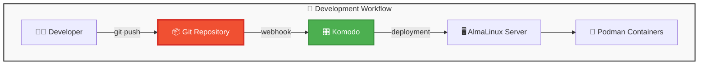
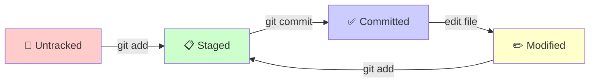

[← Оглавление курса](index.md)

---

# Глава 4. Git: система контроля версий

## 4.1. Что такое Git и зачем он нужен

**Git** — распределенная система управления версиями кода, которая позволяет отслеживать изменения в файлах и координировать работу между разработчиками.

**Ключевые особенности:**
- **Распределенная** — каждый клон — полная копия репозитория
- **Быстрая** — оптимизирована для скорости операций
- **Надежная** — целостность данных гарантируется хешами
- **Гибкая** — поддержка различных workflow
- **Локальная работа** — большинство операций не требуют сети

**Почему Git важен в контексте нашего стека:**



## 4.2. Установка и первичная настройка Git

### Проверка установки Git

На AlmaLinux 9 Git обычно уже установлен:

```bash
git --version
```

Если Git не установлен:

```bash
sudo dnf install git -y
```

### Базовая конфигурация

```bash
# Глобальная конфигурация пользователя
git config --global user.name "Ваше Имя"
git config --global user.email "your.email@example.com"

# Настройка редактора по умолчанию
git config --global core.editor "nano"

# Настройка поведения при пуше
git config --global push.default simple

# Цветной вывод
git config --global color.ui auto

# Автокоррекция команд
git config --global help.autocorrect 1

# Кеширование учетных данных
git config --global credential.helper cache
git config --global credential.helper 'cache --timeout=3600'
```

### Проверка конфигурации

```bash
git config --list
```

## 4.3. Основы работы с Git

### Создание нового репозитория

```bash
# Инициализация нового репозитория
mkdir my-project
cd my-project
git init

# Создание первого файла
echo "# My Project" > README.md
git add README.md
git commit -m "Initial commit"
```

### Основные команды Git

**Жизненный цикл файлов в Git:**



**Основные команды:**

```bash
# Проверка статуса
git status

# Добавление файлов в staging area
git add filename.txt
git add .                    # все файлы
git add *.js                # по маске

# Коммит изменений
git commit -m "Описание изменений"
git commit -am "Добавить и закоммитить измененные файлы"

# Просмотр истории
git log
git log --oneline
git log --graph --oneline --all

# Просмотр различий
git diff                     # рабочая директория vs staging
git diff --staged           # staging vs последний коммит
git diff HEAD~1             # текущий коммит vs предыдущий
```

### Работа с ветками

```bash
# Создание новой ветки
git branch feature-auth
git checkout -b feature-auth    # создать и переключиться

# Переключение между ветками
git checkout main
git checkout feature-auth

# Слияние веток
git checkout main
git merge feature-auth

# Удаление ветки
git branch -d feature-auth      # безопасное удаление
git branch -D feature-auth      # принудительное удаление

# Просмотр веток
git branch                      # локальные ветки
git branch -a                   # все ветки
```

## 4.4. Работа с удаленными репозиториями

### Настройка SSH-ключей для GitHub/GitLab

```bash
# Генерация SSH-ключа
ssh-keygen -t ed25519 -C "your.email@example.com"
ssh-keygen -t rsa -b 4096 -C "your.email@example.com"  # альтернативный вариант

# Добавление ключа в ssh-agent
eval "$(ssh-agent -s)"
ssh-add ~/.ssh/id_ed25519

# Просмотр публичного ключа (добавить в GitHub/GitLab)
cat ~/.ssh/id_ed25519.pub
```

### Работа с remote-репозиториями

```bash
# Добавление удаленного репозитория
git remote add origin git@github.com:username/repository.git

# Первый пуш с установкой upstream
git push -u origin main

# Обычный пуш
git push

# Получение изменений
git fetch origin
git pull origin main
git pull                        # если установлен upstream

# Просмотр удаленных репозиториев
git remote -v
```

## 4.5. Git Workflow для нашего проекта

### Рекомендуемый Git Flow

```mermaid
gitgraph
    commit id: "Initial commit"
    branch develop
    checkout develop
    commit id: "Setup project"
    branch feature/auth
    checkout feature/auth
    commit id: "Add authentication"
    commit id: "Add tests"
    checkout develop
    merge feature/auth
    branch feature/api
    checkout feature/api
    commit id: "Add REST API"
    checkout develop
    merge feature/api
    checkout main
    merge develop
    commit id: "Release v1.0"
```

### Структура веток

```bash
# Основные ветки
main           # production-ready код
develop        # интеграционная ветка

# Временные ветки
feature/*      # новые функции
hotfix/*       # критические исправления
release/*      # подготовка к релизу
```

### Соглашения о коммитах

**Формат сообщений коммитов:**

```
<type>(<scope>): <subject>

<body>

<footer>
```

**Типы коммитов:**
- `feat`: новая функциональность
- `fix`: исправление бага
- `docs`: изменения в документации
- `style`: форматирование, отступы
- `refactor`: рефакторинг кода
- `test`: добавление тестов
- `chore`: обслуживание проекта

**Примеры:**

```bash
git commit -m "feat(auth): add JWT authentication"
git commit -m "fix(api): handle null response in user service"
git commit -m "docs: update README with installation steps"
```

## 4.6. .gitignore для нашего стека

### Создание .gitignore файла

```bash
# Создание файла
touch .gitignore
```

**Содержимое .gitignore для нашего проекта:**

```gitignore
# Node.js
node_modules/
npm-debug.log*
yarn-debug.log*
yarn-error.log*
.npm
.yarn-integrity

# Build outputs
dist/
build/
out/

# Environment variables
.env
.env.local
.env.development.local
.env.test.local
.env.production.local

# IDE
.vscode/
.idea/
*.swp
*.swo
*~

# OS
.DS_Store
.DS_Store?
._*
.Spotlight-V100
.Trashes
ehthumbs.db
Thumbs.db

# Logs
logs
*.log

# Runtime data
pids
*.pid
*.seed
*.pid.lock

# Coverage directory used by tools like istanbul
coverage/
.nyc_output/

# Dependency directories
jspm_packages/

# Optional npm cache directory
.npm

# Optional eslint cache
.eslintcache

# Docker
.dockerignore
*.tar

# Database
*.sqlite
*.db

# Temporary files
tmp/
temp/

# Container data
data/
volumes/

# SSL certificates (if not needed in repo)
*.pem
*.key
*.crt

# Backup files
*.bak
*.backup
```

## 4.7. Git hooks и автоматизация

### Pre-commit hooks

Создание pre-commit hook для проверки кода:

```bash
# Создание hook файла
nano .git/hooks/pre-commit
chmod +x .git/hooks/pre-commit
```

**Содержимое pre-commit hook:**

```bash
#!/bin/sh
# Pre-commit hook для проверки качества кода

echo "🔍 Running pre-commit checks..."

# Проверка синтаксиса JavaScript/TypeScript
if command -v npm >/dev/null 2>&1; then
    echo "📝 Checking code style..."
    npm run lint
    if [ $? -ne 0 ]; then
        echo "❌ Lint check failed. Please fix errors before committing."
        exit 1
    fi
fi

# Проверка тестов
if [ -f "package.json" ] && grep -q "test" package.json; then
    echo "🧪 Running tests..."
    npm test
    if [ $? -ne 0 ]; then
        echo "❌ Tests failed. Please fix tests before committing."
        exit 1
    fi
fi

echo "✅ All checks passed!"
exit 0
```

### Commit-msg hook для проверки формата сообщений

```bash
nano .git/hooks/commit-msg
chmod +x .git/hooks/commit-msg
```

**Содержимое commit-msg hook:**

```bash
#!/bin/sh
# Проверка формата сообщения коммита

commit_regex='^(feat|fix|docs|style|refactor|test|chore)(\(.+\))?: .{1,50}'

error_msg="❌ Invalid commit message format. Use: type(scope): description
Examples:
  feat(auth): add user registration
  fix(api): handle null response
  docs: update README"

if ! grep -qE "$commit_regex" "$1"; then
    echo "$error_msg"
    exit 1
fi

echo "✅ Commit message format is valid"
```

## 4.8. Интеграция Git с Komodo

### Настройка Git-based деплоя в Komodo

**1. Создание deployment в Komodo:**

```yaml
# komodo-deployment.yml
name: "top-web-stack"
git_provider: "github"
git_account: "your-username"
repository: "TopWebStack"
branch: "main"
build_path: "."
dockerfile_path: "Dockerfile"
```

**2. Webhook для автоматического деплоя:**

После настройки deployment в Komodo, система автоматически создаст webhook URL. Добавьте его в настройки репозитория GitHub/GitLab:

- **Payload URL**: `https://your-komodo.example.com/api/webhook/deploy/deployment-id`
- **Content Type**: `application/json`
- **Events**: Push events

**3. Автоматизация через GitHub Actions:**

```yaml
# .github/workflows/deploy.yml
name: Deploy to Production

on:
  push:
    branches: [ main ]

jobs:
  deploy:
    runs-on: ubuntu-latest
    steps:
    - uses: actions/checkout@v3
    
    - name: Deploy to Komodo
      run: |
        curl -X POST \
          -H "Authorization: Bearer ${{ secrets.KOMODO_API_KEY }}" \
          -H "Content-Type: application/json" \
          -d '{"branch": "main"}' \
          https://your-komodo.example.com/api/deployment/redeploy/deployment-id
```

## 4.9. Практические сценарии и troubleshooting

### Откат изменений

```bash
# Отмена изменений в рабочей директории
git checkout -- filename.txt
git checkout .                    # все файлы

# Отмена последнего коммита (сохранив изменения)
git reset --soft HEAD~1

# Отмена последнего коммита (удалив изменения)
git reset --hard HEAD~1

# Создание коммита, отменяющего изменения
git revert HEAD
git revert commit-hash
```

### Работа с конфликтами

```bash
# При конфликте слияния
git status                        # просмотр конфликтных файлов
# Редактируем файлы, убирая маркеры конфликтов
git add conflicted-file.txt
git commit -m "Resolve merge conflict"

# Отмена слияния
git merge --abort
```

### Полезные команды для отладки

```bash
# Поиск коммита, который ввел баг
git bisect start
git bisect bad HEAD
git bisect good commit-hash
# Git автоматически найдет проблемный коммит

# Просмотр истории изменений файла
git log --follow filename.txt
git blame filename.txt

# Временное сохранение изменений
git stash
git stash pop
git stash list
git stash drop
```

### Очистка репозитория

```bash
# Удаление неотслеживаемых файлов
git clean -f                     # файлы
git clean -fd                    # файлы и директории
git clean -n                     # просмотр без удаления

# Сжатие репозитория
git gc --aggressive --prune=now
```

## 4.10. Заключение главы

В этой главе мы изучили:

✅ **Основы Git** — понимание принципов работы распределенной системы контроля версий

✅ **Настройку Git** — конфигурация для продуктивной работы в команде

✅ **Git workflow** — организация процесса разработки с ветками и коммитами

✅ **Интеграцию с Komodo** — автоматический деплой через Git hooks

✅ **Best practices** — соглашения о коммитах и структуре проекта

**Что дальше:**

В следующей главе мы установим и настроим **Komodo** — систему управления инфраструктурой, которая будет использовать Git для автоматического деплоя наших контейнерных приложений.

---

**Навигация:**
- [← Глава 3: Podman](chapter-03-podman.md)
- [→ Глава 5: Komodo](chapter-05-comodo.md)
- [📚 Оглавление курса](index.md)