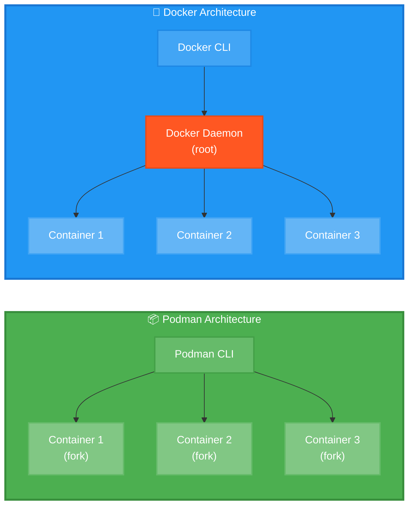
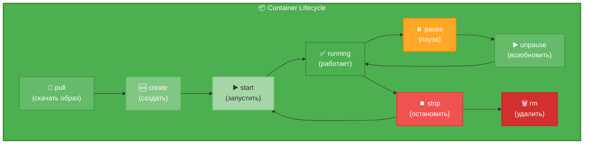
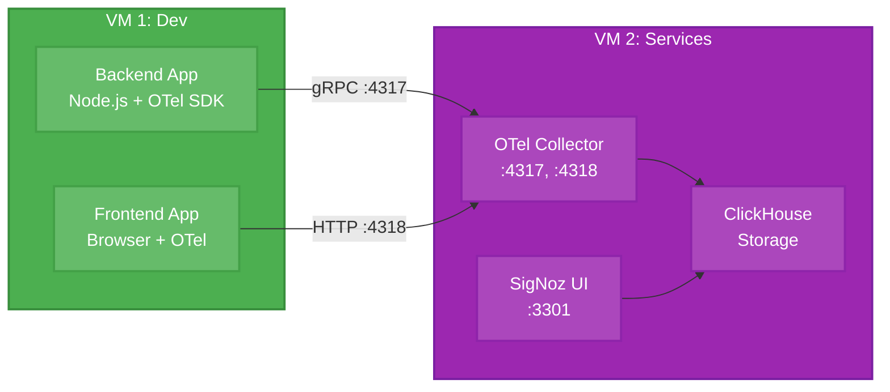

[← Оглавление курса](index.md)


# Глава 3. Podman: контейнеризация без Docker

## 3.1. Что такое Podman и чем он отличается от Docker

**Podman (Pod Manager)** — инструмент для управления контейнерами и образами, совместимый с OCI (Open Container Initiative).

**Ключевые характеристики:**
- **Daemonless** — не требует фонового процесса
- **Rootless** — запуск контейнеров без root-прав
- **Совместимость** — использует те же команды, что и Docker
- **Безопасность** — изоляция на уровне пользователя
- **Pods** — поддержка Kubernetes-подобных подов

**Отличия от Docker:**



| Характеристика | Podman | Docker |
|---|---|---|
| Архитектура | Daemonless (форк процесса) | Client-Server (daemon) |
| Root-права | Не требуются (rootless) | Требуются для daemon |
| Безопасность | Выше (изоляция пользователя) | Ниже (общий daemon) |
| Pods | Нативная поддержка | Требуется Kubernetes |
| Systemd | Встроенная интеграция | Требуется настройка |
| Совместимость | Docker CLI compatible | Стандарт де-факто |

**Где применяется:**
- Enterprise-окружения с высокими требованиями к безопасности
- RHEL/Fedora/AlmaLinux экосистема
- CI/CD пайплайны
- Development-окружения
- Production без Kubernetes

**Почему в этом курсе:**
- Стандарт для RHEL-based систем
- Лучшая безопасность через rootless
- Нативная интеграция с systemd
- Не требует привилегированного доступа
- Совместимость с Docker-образами

**Распространенность:**
- Стандарт в Red Hat экосистеме
- Растущее принятие в enterprise
- Поддержка всех major cloud providers
- Активное развитие и сообщество

**Актуальная версия:** Podman 5.4.0

**Ссылки:**
- Официальный сайт: https://podman.io/
- GitHub: https://github.com/containers/podman
- Документация: https://docs.podman.io/
- Podman Desktop: https://podman-desktop.io/


## 3.2. Установка Podman 5.4

**Podman включен в стандартные репозитории AlmaLinux 9.**

### Установка

```bash
# Установка EPEL репозитория (необходим для podman-compose)
sudo dnf install -y https://dl.fedoraproject.org/pub/epel/epel-release-latest-9.noarch.rpm

# Проверка доступной версии
dnf info podman

# Установка Podman и связанных инструментов
# podman - основной инструмент для управления контейнерами
# podman-compose - оркестрация multi-container приложений (аналог docker-compose)
# buildah - инструмент для сборки OCI-совместимых образов контейнеров
# skopeo - работа с образами (копирование, инспекция, удаление)
sudo dnf install -y \
  podman \
  podman-compose \
  buildah \
  skopeo
```

**Описание установленных пакетов:**

1. **podman** — основной инструмент для управления контейнерами и подами
   - Запуск, остановка, управление контейнерами
   - Работа с образами (pull, push, build)
   - Управление подами (группы контейнеров)
   - Совместимость с Docker CLI

2. **podman-compose** — оркестрация multi-container приложений
   - Чтение docker-compose.yml файлов
   - Запуск нескольких связанных контейнеров
   - Управление сетями и volumes
   - Альтернатива docker-compose

3. **buildah** — специализированный инструмент для сборки образов
   - Создание образов из Dockerfile
   - Создание образов из scratch
   - Модификация существующих образов
   - Более гибкий, чем `podman build`

4. **skopeo** — работа с образами без их загрузки
   - Копирование образов между registry
   - Инспекция образов удаленно
   - Удаление образов из registry
   - Синхронизация образов

**Проверка установки:**

```bash
# Проверка версий
podman --version
# Вывод: podman version 5.4.0

buildah --version
# Вывод: buildah version 1.35.0

skopeo --version
# Вывод: skopeo version 1.14.0

podman-compose --version
# Вывод: podman-compose version 1.0.6

# Информация о системе Podman
podman info
```

### Настройка rootless режима

```bash
# Проверка поддержки rootless
podman info | grep rootless
# Вывод: rootless: true

# Настройка subuid и subgid (обычно уже настроено)
grep $USER /etc/subuid
grep $USER /etc/subgid

# Если пусто, добавьте:
echo "$USER:100000:65536" | sudo tee -a /etc/subuid
echo "$USER:100000:65536" | sudo tee -a /etc/subgid

# Перелогиньтесь для применения изменений
```

### Настройка хранилища

```bash
# Создание директории для контейнеров
mkdir -p ~/.local/share/containers/storage

# Проверка конфигурации хранилища
podman info --format='{{.Store.GraphRoot}}'
# Вывод: /home/developer/.local/share/containers/storage
```

### Настройка registries

**Документация:** https://github.com/containers/image/blob/main/docs/containers-registries.conf.5.md

```bash
# Редактирование конфигурации registries
nano ~/.config/containers/registries.conf
```

Добавьте:

```toml
unqualified-search-registries = ["docker.io", "quay.io", "ghcr.io"]

[[registry]]
location = "docker.io"
insecure = false

[[registry]]
location = "quay.io"
insecure = false
```


## 3.3. Основные команды Podman

**Жизненный цикл контейнера:**



**Podman использует те же команды, что и Docker. Можно создать alias:**

```bash
# Добавьте в ~/.bashrc
echo "alias docker=podman" >> ~/.bashrc
source ~/.bashrc
```

### Работа с образами

```bash
# Поиск образа
podman search nginx

# Скачивание образа
podman pull docker.io/library/nginx:latest

# Список локальных образов
podman images

# Информация об образе
podman inspect nginx:latest

# Удаление образа
podman rmi nginx:latest

# Удаление неиспользуемых образов
podman image prune -a
```

### Работа с контейнерами

```bash
# Запуск контейнера
podman run -d --name mynginx -p 8080:80 nginx:latest

# Список запущенных контейнеров
podman ps

# Список всех контейнеров (включая остановленные)
podman ps -a

# Логи контейнера
podman logs mynginx

# Логи в реальном времени
podman logs -f mynginx

# Выполнение команды в контейнере
podman exec -it mynginx bash

# Остановка контейнера
podman stop mynginx

# Запуск остановленного контейнера
podman start mynginx

# Перезапуск контейнера
podman restart mynginx

# Удаление контейнера
podman rm mynginx

# Удаление с остановкой
podman rm -f mynginx
```

### Статистика и мониторинг

```bash
# Использование ресурсов
podman stats

# Информация о контейнере
podman inspect mynginx

# Процессы в контейнере
podman top mynginx

# События контейнера
podman events
```


## 3.4. Работа с образами и контейнерами

### Создание собственного образа

**Создание Dockerfile:**

```bash
# Создание директории проекта
mkdir ~/hello-podman && cd ~/hello-podman

# Создание простого Node.js приложения
nano server.js
```

Содержимое `server.js`:

```javascript
const http = require('http');

const server = http.createServer((req, res) => {
  res.writeHead(200, { 'Content-Type': 'text/plain' });
  res.end('Hello from Podman!\n');
});

server.listen(3000, () => {
  console.log('Server running on port 3000');
});
```

**Создание Dockerfile:**

```bash
nano Dockerfile
```

Содержимое:

```dockerfile
FROM docker.io/library/node:26-alpine

WORKDIR /app

COPY server.js .

EXPOSE 3000

CMD ["node", "server.js"]
```

**Сборка образа:**

```bash
# Сборка с тегом
podman build -t hello-podman:1.0 .

# Проверка созданного образа
podman images | grep hello-podman

# Запуск контейнера из образа
podman run -d --name hello -p 3000:3000 hello-podman:1.0

# Проверка работы
curl http://localhost:3000
# Вывод: Hello from Podman!

# Просмотр логов
podman logs hello
```

### Работа с volumes

```bash
# Создание volume
podman volume create mydata

# Список volumes
podman volume ls

# Информация о volume
podman volume inspect mydata

# Запуск контейнера с volume
podman run -d --name postgres \
  -v mydata:/var/lib/postgresql/data \
  -e POSTGRES_PASSWORD=secret \
  postgres:18-alpine

# Удаление volume
podman volume rm mydata

# Удаление неиспользуемых volumes
podman volume prune
```

### Работа с сетями

```bash
# Список сетей
podman network ls

# Создание сети
podman network create mynetwork

# Информация о сети
podman network inspect mynetwork

# Запуск контейнера в сети
podman run -d --name app --network mynetwork nginx

# Подключение контейнера к сети
podman network connect mynetwork hello

# Отключение от сети
podman network disconnect mynetwork hello

# Удаление сети
podman network rm mynetwork
```


## 3.5. Podman Compose: оркестрация контейнеров

**Podman Compose** — инструмент для управления multi-container приложениями, совместимый с Docker Compose.

### Установка

```bash
# Установка через DNF (уже установлено ранее)
sudo dnf install -y podman-compose

# Проверка версии
podman-compose --version
```

### Создание compose-файла

**Документация:** https://docs.podman.io/en/latest/markdown/podman-compose.1.html

```bash
# Создание проекта
mkdir ~/mystack && cd ~/mystack

# Создание docker-compose.yml
nano docker-compose.yml
```

Содержимое:

```yaml
version: '3.8'

services:
  web:
    image: nginx:alpine
    ports:
      - "8080:80"
    volumes:
      - ./html:/usr/share/nginx/html:ro
    networks:
      - frontend
    restart: unless-stopped

  api:
    image: node:26-alpine
    working_dir: /app
    volumes:
      - ./api:/app
    command: node server.js
    ports:
      - "3000:3000"
    networks:
      - frontend
      - backend
    environment:
      - NODE_ENV=production
    restart: unless-stopped

  db:
    image: postgres:18-alpine
    environment:
      POSTGRES_DB: myapp
      POSTGRES_USER: developer
      POSTGRES_PASSWORD: secret123
    volumes:
      - pgdata:/var/lib/postgresql/data
    networks:
      - backend
    restart: unless-stopped

networks:
  frontend:
  backend:

volumes:
  pgdata:
```

### Управление стеком

```bash
# Запуск всех сервисов
podman-compose up -d

# Просмотр логов
podman-compose logs

# Логи конкретного сервиса
podman-compose logs web

# Список контейнеров
podman-compose ps

# Остановка всех сервисов
podman-compose stop

# Запуск остановленных сервисов
podman-compose start

# Перезапуск сервисов
podman-compose restart

# Остановка и удаление
podman-compose down

# Удаление с volumes
podman-compose down -v
```


## 3.6. Rootless-контейнеры и безопасность

### Преимущества rootless

**Rootless-контейнеры** запускаются от имени обычного пользователя без root-прав.

**Преимущества:**
- Изоляция на уровне пользователя
- Невозможность повышения привилегий
- Защита хост-системы
- Соответствие security best practices

### Проверка rootless режима

```bash
# Проверка режима
podman info | grep rootless
# Вывод: rootless: true

# Запуск контейнера в rootless
podman run -d --name test nginx:alpine

# Проверка процессов на хосте
ps aux | grep nginx
# Процессы запущены от вашего пользователя, не от root
```

### Ограничения rootless

```bash
# Порты < 1024 недоступны напрямую
# Используйте порты >= 1024 или port mapping

# Неправильно (требует root):
podman run -p 80:80 nginx

# Правильно (rootless):
podman run -p 8080:80 nginx
```

### Интеграция с systemd

**Создание systemd-сервиса для контейнера:**

```bash
# Создание директории для user services
mkdir -p ~/.config/systemd/user

# Генерация systemd unit файла
podman generate systemd --new --name mynginx > ~/.config/systemd/user/container-mynginx.service

# Перезагрузка systemd
systemctl --user daemon-reload

# Запуск сервиса
systemctl --user start container-mynginx

# Автозапуск при логине пользователя
systemctl --user enable container-mynginx

# Проверка статуса
systemctl --user status container-mynginx
```

### Автозапуск без логина

```bash
# Включение lingering (автозапуск без логина)
sudo loginctl enable-linger $USER

# Проверка
loginctl show-user $USER | grep Linger
# Вывод: Linger=yes
```


## 3.7. Безопасность контейнеров

### Принципы безопасности контейнеров

**Основные принципы:**
- ✅ Запуск контейнеров в rootless режиме
- ✅ Использование минимальных базовых образов (alpine, distroless)
- ✅ Регулярное обновление образов
- ✅ Сканирование образов на уязвимости
- ✅ Ограничение ресурсов контейнеров
- ✅ Использование read-only файловых систем где возможно
- ✅ Минимизация привилегий контейнеров
- ✅ Изоляция сетей между контейнерами

### Сканирование образов на уязвимости

**Использование Trivy для сканирования:**

```bash
# Установка Trivy
sudo dnf install -y wget
wget https://github.com/aquasecurity/trivy/releases/download/v0.58.0/trivy_0.58.0_Linux-64bit.rpm
sudo rpm -ivh trivy_0.58.0_Linux-64bit.rpm

# Сканирование локального образа
trivy image nginx:latest

# Сканирование с фильтрацией по критичности
trivy image --severity HIGH,CRITICAL nginx:latest

# Сканирование образа из registry без загрузки
trivy image --severity CRITICAL docker.io/library/postgres:18-alpine

# Сканирование Dockerfile
trivy config Dockerfile

# Генерация отчета в JSON
trivy image -f json -o report.json nginx:latest
```

**Интерпретация результатов:**

```bash
# Пример вывода Trivy
nginx:latest (alpine 3.19.0)
===========================
Total: 15 (HIGH: 3, CRITICAL: 2)

┌───────────────┬────────────────┬──────────┬───────────────────┬───────────────┬────────────────────────────────────┐
│   Library     │ Vulnerability  │ Severity │ Installed Version │ Fixed Version │             Title                  │
├───────────────┼────────────────┼──────────┼───────────────────┼───────────────┼────────────────────────────────────┤
│ openssl       │ CVE-2024-XXXX  │ CRITICAL │ 3.1.4-r0          │ 3.1.4-r5      │ OpenSSL: Buffer overflow in...     │
│ libcrypto3    │ CVE-2024-YYYY  │ HIGH     │ 3.1.4-r0          │ 3.1.4-r5      │ OpenSSL: Memory leak in...         │
└───────────────┴────────────────┴──────────┴───────────────────┴───────────────┴────────────────────────────────────┘
```

**Действия при обнаружении уязвимостей:**

1. **CRITICAL/HIGH** — обновите образ или используйте альтернативу
2. **MEDIUM** — запланируйте обновление
3. **LOW** — мониторьте, обновляйте при возможности

### Ограничение ресурсов контейнеров

**Ограничение CPU и памяти:**

```bash
# Ограничение памяти (512 MB)
podman run -d --name limited-app \
  --memory="512m" \
  --memory-swap="512m" \
  nginx:alpine

# Ограничение CPU (50% одного ядра)
podman run -d --name cpu-limited \
  --cpus="0.5" \
  nginx:alpine

# Комбинированные ограничения
podman run -d --name resource-limited \
  --memory="1g" \
  --memory-swap="1g" \
  --cpus="1.0" \
  --pids-limit=100 \
  nginx:alpine

# Проверка ограничений
podman inspect resource-limited | grep -A 10 "Memory"
```

**Ограничение в docker-compose.yml:**

```yaml
version: '3.8'

services:
  backend:
    image: node:26-alpine
    deploy:
      resources:
        limits:
          cpus: '1.0'
          memory: 1G
        reservations:
          cpus: '0.5'
          memory: 512M
    restart: unless-stopped
```

### Read-only файловые системы

**Запуск контейнера с read-only root filesystem:**

```bash
# Базовый read-only контейнер
podman run -d --name readonly-nginx \
  --read-only \
  --tmpfs /var/cache/nginx \
  --tmpfs /var/run \
  nginx:alpine

# Проверка
podman exec readonly-nginx touch /test.txt
# Ошибка: Read-only file system
```

**В docker-compose.yml:**

```yaml
version: '3.8'

services:
  web:
    image: nginx:alpine
    read_only: true
    tmpfs:
      - /var/cache/nginx
      - /var/run
      - /tmp
```

### Управление capabilities

**Linux capabilities** позволяют тонко настроить привилегии контейнера.

```bash
# Запуск без дополнительных capabilities (по умолчанию)
podman run -d --name secure-app nginx:alpine

# Удаление всех capabilities и добавление только необходимых
podman run -d --name minimal-caps \
  --cap-drop=ALL \
  --cap-add=NET_BIND_SERVICE \
  nginx:alpine

# Просмотр capabilities контейнера
podman inspect minimal-caps | grep -A 20 "CapAdd"
```

**Рекомендуемые capabilities для типичных приложений:**

| Приложение | Необходимые capabilities |
|------------|-------------------------|
| Web сервер (порт > 1024) | Нет |
| Web сервер (порт < 1024) | NET_BIND_SERVICE |
| База данных | CHOWN, SETUID, SETGID |
| Приложение с ping | NET_RAW |

### Сетевая изоляция

**Создание изолированных сетей:**

```bash
# Создание frontend сети
podman network create frontend

# Создание backend сети
podman network create backend

# Запуск frontend контейнера (только frontend сеть)
podman run -d --name web \
  --network frontend \
  nginx:alpine

# Запуск backend контейнера (обе сети)
podman run -d --name api \
  --network frontend \
  node:26-alpine

podman network connect backend api

# Запуск БД (только backend сеть)
podman run -d --name db \
  --network backend \
  postgres:18-alpine

# Теперь:
# - web может общаться с api
# - api может общаться с db
# - web НЕ может напрямую общаться с db
```

### Secrets management

**Использование Podman secrets:**

```bash
# Создание secret из файла
echo "my_secret_password" | podman secret create db_password -

# Создание secret из stdin
podman secret create api_key --driver=file

# Список secrets
podman secret ls

# Использование secret в контейнере
podman run -d --name app \
  --secret db_password \
  myapp:latest

# В контейнере secret доступен в /run/secrets/db_password
```

**В docker-compose.yml:**

```yaml
version: '3.8'

services:
  db:
    image: postgres:18-alpine
    secrets:
      - db_password
    environment:
      POSTGRES_PASSWORD_FILE: /run/secrets/db_password

secrets:
  db_password:
    file: ./secrets/db_password.txt
```

### Security best practices checklist

**Перед деплоем контейнера проверьте:**

- [ ] Контейнер запускается в rootless режиме
- [ ] Образ просканирован на уязвимости (Trivy)
- [ ] Используется минимальный базовый образ (alpine/distroless)
- [ ] Установлены ограничения CPU и памяти
- [ ] Используется read-only filesystem где возможно
- [ ] Удалены ненужные capabilities
- [ ] Контейнер изолирован в отдельной сети
- [ ] Секреты не хранятся в переменных окружения
- [ ] Образ подписан и верифицирован
- [ ] Логи контейнера централизованно собираются


## 3.8. Мониторинг контейнеров

### Базовый мониторинг через Podman

**Просмотр использования ресурсов:**

```bash
# Статистика всех запущенных контейнеров
podman stats

# Статистика конкретного контейнера
podman stats mynginx

# Статистика без потоковой передачи (один снимок)
podman stats --no-stream

# Форматированный вывод
podman stats --format "table {{.Name}}\t{{.CPUPerc}}\t{{.MemUsage}}"
```

**Просмотр логов:**

```bash
# Логи контейнера
podman logs mynginx

# Логи в реальном времени
podman logs -f mynginx

# Последние 100 строк
podman logs --tail 100 mynginx

# Логи с временными метками
podman logs -t mynginx

# Логи за последний час
podman logs --since 1h mynginx
```

**Инспекция контейнера:**

```bash
# Полная информация о контейнере
podman inspect mynginx

# Извлечение конкретных данных
podman inspect mynginx --format='{{.State.Status}}'
podman inspect mynginx --format='{{.NetworkSettings.IPAddress}}'
podman inspect mynginx --format='{{.Config.Image}}'

# Использование ресурсов
podman inspect mynginx --format='{{.HostConfig.Memory}}'
podman inspect mynginx --format='{{.HostConfig.NanoCpus}}'
```

### Мониторинг через Cockpit

**Установка Cockpit Podman плагина:**

```bash
# Установка плагина
sudo dnf install -y cockpit-podman

# Перезапуск Cockpit
sudo systemctl restart cockpit.socket

# Доступ к Cockpit
# https://192.168.1.150:9090
```

**Возможности Cockpit Podman:**
- 📊 Просмотр списка контейнеров и их статуса
- 📈 Графики использования CPU, памяти, сети
- 📝 Просмотр логов контейнеров
- 🔄 Управление контейнерами (старт, стоп, рестарт)
- 🖼️ Управление образами
- 🌐 Управление сетями и volumes
- 📦 Управление подами

### Интеграция с SigNoz (OpenTelemetry)

**Подключение контейнеров к SigNoz для мониторинга:**

**Архитектура мониторинга:**



**Настройка OpenTelemetry в Node.js приложении:**

```javascript
// instrumentation.js
const { NodeSDK } = require('@opentelemetry/sdk-node');
const { OTLPTraceExporter } = require('@opentelemetry/exporter-trace-otlp-grpc');
const { OTLPMetricExporter } = require('@opentelemetry/exporter-metrics-otlp-grpc');
const { Resource } = require('@opentelemetry/resources');
const { SemanticResourceAttributes } = require('@opentelemetry/semantic-conventions');

const sdk = new NodeSDK({
  resource: new Resource({
    [SemanticResourceAttributes.SERVICE_NAME]: 'eventbrain-backend',
    [SemanticResourceAttributes.SERVICE_VERSION]: '1.0.0',
    [SemanticResourceAttributes.DEPLOYMENT_ENVIRONMENT]: 'development',
  }),
  traceExporter: new OTLPTraceExporter({
    url: 'http://192.168.1.151:4317', // SigNoz OTel Collector на VM2
  }),
  metricReader: new PeriodicExportingMetricReader({
    exporter: new OTLPMetricExporter({
      url: 'http://192.168.1.151:4317',
    }),
  }),
});

sdk.start();
```

**Запуск приложения с OpenTelemetry:**

```bash
# Установка зависимостей
npm install --save \
  @opentelemetry/sdk-node \
  @opentelemetry/exporter-trace-otlp-grpc \
  @opentelemetry/exporter-metrics-otlp-grpc \
  @opentelemetry/resources \
  @opentelemetry/semantic-conventions

# Запуск с инструментацией
node --require ./instrumentation.js server.js
```

**Настройка в docker-compose.yml:**

```yaml
version: '3.8'

services:
  backend:
    image: node:26-alpine
    environment:
      - NODE_ENV=development
      - OTEL_EXPORTER_OTLP_ENDPOINT=http://192.168.1.151:4317
      - OTEL_SERVICE_NAME=eventbrain-backend
      - OTEL_RESOURCE_ATTRIBUTES=deployment.environment=development
    command: node --require ./instrumentation.js server.js
    networks:
      - app-network

networks:
  app-network:
    driver: bridge
```

### Экспорт метрик контейнеров

**Использование cAdvisor для метрик контейнеров:**

```bash
# Запуск cAdvisor
podman run -d \
  --name cadvisor \
  --volume=/:/rootfs:ro \
  --volume=/var/run:/var/run:ro \
  --volume=/sys:/sys:ro \
  --volume=/var/lib/containers:/var/lib/containers:ro \
  --publish=8080:8080 \
  --privileged \
  gcr.io/cadvisor/cadvisor:latest

# Доступ к метрикам
curl http://localhost:8080/metrics

# Веб-интерфейс
# http://192.168.1.150:8080
```

**Интеграция cAdvisor с SigNoz через Prometheus:**

```yaml
# prometheus.yml
scrape_configs:
  - job_name: 'cadvisor'
    static_configs:
      - targets: ['192.168.1.150:8080']
    metric_relabel_configs:
      - source_labels: [__name__]
        regex: 'container_.*'
        action: keep
```

### Health checks и автоматический рестарт

**Настройка health checks:**

```bash
# Запуск контейнера с health check
podman run -d --name web \
  --health-cmd="curl -f http://localhost/ || exit 1" \
  --health-interval=30s \
  --health-timeout=10s \
  --health-retries=3 \
  --health-start-period=40s \
  nginx:alpine

# Проверка статуса health check
podman inspect web --format='{{.State.Health.Status}}'

# Просмотр истории health checks
podman inspect web --format='{{json .State.Health}}' | jq
```

**В docker-compose.yml:**

```yaml
version: '3.8'

services:
  backend:
    image: node:26-alpine
    healthcheck:
      test: ["CMD", "curl", "-f", "http://localhost:3000/health"]
      interval: 30s
      timeout: 10s
      retries: 3
      start_period: 40s
    restart: unless-stopped

  postgres:
    image: postgres:18-alpine
    healthcheck:
      test: ["CMD-SHELL", "pg_isready -U postgres"]
      interval: 10s
      timeout: 5s
      retries: 5
    restart: unless-stopped
```

### Алертинг и уведомления

**Мониторинг через systemd и email уведомления:**

```bash
# Создание скрипта мониторинга
cat > ~/monitor-containers.sh << 'EOF'
#!/bin/bash

# Проверка статуса контейнеров
FAILED=$(podman ps -a --filter "status=exited" --format "{{.Names}}")

if [ ! -z "$FAILED" ]; then
    echo "Failed containers: $FAILED"
    # Отправка email (требует настройки mail)
    echo "Containers failed: $FAILED" | mail -s "Container Alert" admin@example.com
    
    # Или запись в syslog
    logger -t container-monitor "Failed containers: $FAILED"
fi
EOF

chmod +x ~/monitor-containers.sh

# Создание systemd timer
mkdir -p ~/.config/systemd/user

cat > ~/.config/systemd/user/container-monitor.service << EOF
[Unit]
Description=Container Monitor

[Service]
Type=oneshot
ExecStart=/home/developer/monitor-containers.sh
EOF

cat > ~/.config/systemd/user/container-monitor.timer << EOF
[Unit]
Description=Container Monitor Timer

[Timer]
OnBootSec=5min
OnUnitActiveSec=5min

[Install]
WantedBy=timers.target
EOF

# Активация timer
systemctl --user daemon-reload
systemctl --user enable --now container-monitor.timer
systemctl --user list-timers
```

### Централизованное логирование

**Настройка отправки логов в SigNoz:**

```yaml
# docker-compose.yml с логированием
version: '3.8'

services:
  backend:
    image: node:26-alpine
    logging:
      driver: "json-file"
      options:
        max-size: "10m"
        max-file: "3"
        labels: "service,environment"
    labels:
      service: "backend"
      environment: "development"

  # Fluentd для сбора логов
  fluentd:
    image: fluent/fluentd:latest
    volumes:
      - ./fluentd/conf:/fluentd/etc
      - /var/lib/containers:/var/lib/containers:ro
    ports:
      - "24224:24224"
    environment:
      - FLUENTD_CONF=fluent.conf
```

**Конфигурация Fluentd для отправки в SigNoz:**

```xml
<!-- fluentd/conf/fluent.conf -->
<source>
  @type forward
  port 24224
  bind 0.0.0.0
</source>

<match **>
  @type http
  endpoint http://192.168.1.151:8428/insert/0/prometheus/api/v1/write
  json_array true
  <format>
    @type json
  </format>
  <buffer>
    flush_interval 10s
  </buffer>
</match>
```


## Практическое задание

**Задание 1: Установка и базовая настройка**
1. Установите Podman, podman-compose, buildah, skopeo
2. Проверьте rootless режим
3. Настройте registries.conf
4. Установите Trivy для сканирования образов

**Задание 2: Создание приложения**
1. Создайте простое Node.js приложение с health check endpoint
2. Создайте Dockerfile с использованием alpine образа
3. Соберите образ и просканируйте его на уязвимости
4. Запустите контейнер с ограничениями ресурсов

**Задание 3: Multi-container приложение**
1. Создайте docker-compose.yml с 3 сервисами (web, api, db)
2. Настройте изолированные сети (frontend, backend)
3. Добавьте health checks для всех сервисов
4. Настройте ограничения ресурсов для каждого сервиса
5. Запустите стек через podman-compose

**Задание 4: Безопасность**
1. Настройте read-only filesystem для web сервиса
2. Создайте secret для пароля базы данных
3. Удалите ненужные capabilities из контейнеров
4. Проверьте, что все контейнеры работают в rootless режиме

**Задание 5: Systemd интеграция**
1. Создайте systemd-сервис для одного из контейнеров
2. Настройте автозапуск при загрузке системы
3. Включите lingering для пользователя
4. Проверьте автоматический рестарт при падении контейнера

**Задание 6: Мониторинг**
1. Установите Cockpit Podman плагин
2. Настройте мониторинг ресурсов через podman stats
3. Настройте централизованный сбор логов
4. Создайте скрипт мониторинга статуса контейнеров

**Задание 7: OpenTelemetry интеграция (опционально)**
1. Добавьте OpenTelemetry SDK в Node.js приложение
2. Настройте отправку метрик и трейсов в SigNoz
3. Проверьте визуализацию метрик в SigNoz UI
4. Настройте алерты на основе метрик

## Проверка знаний

```bash
# 1. Версия и режим работы
podman --version
podman info | grep rootless

# 2. Образы и контейнеры
podman images | wc -l
podman ps | wc -l
podman ps -a | wc -l

# 3. Сканирование безопасности
trivy image nginx:alpine --severity HIGH,CRITICAL

# 4. Статистика ресурсов
podman stats --no-stream

# 5. Проверка health checks
podman inspect <container> --format='{{.State.Health.Status}}'

# 6. Проверка сетей
podman network ls
podman network inspect frontend

# 7. Проверка secrets
podman secret ls

# 8. Проверка systemd сервисов
systemctl --user list-units --type=service | grep container

# 9. Проверка lingering
loginctl show-user $USER | grep Linger

# 10. Логи контейнера
podman logs --tail 50 <container>
```

## Дополнительные ресурсы

**Официальная документация:**
- Podman: https://docs.podman.io/
- Podman Compose: https://github.com/containers/podman-compose
- Buildah: https://buildah.io/
- Skopeo: https://github.com/containers/skopeo

**Безопасность:**
- Trivy: https://trivy.dev/
- Container Security Best Practices: https://cheatsheetseries.owasp.org/cheatsheets/Docker_Security_Cheat_Sheet.html
- CIS Docker Benchmark: https://www.cisecurity.org/benchmark/docker

**Мониторинг:**
- OpenTelemetry: https://opentelemetry.io/
- SigNoz: https://signoz.io/docs/
- cAdvisor: https://github.com/google/cadvisor

**Сообщество:**
- Podman GitHub: https://github.com/containers/podman
- Podman Blog: https://podman.io/blogs/
- Red Hat Developer: https://developers.redhat.com/topics/containers


