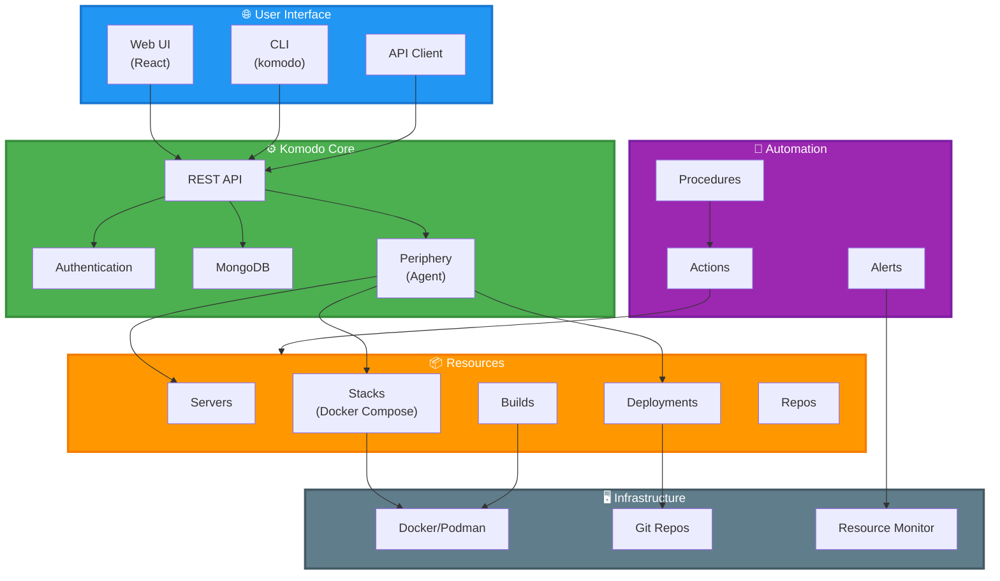

[← Оглавление курса](index.md)

---

# Глава 5. Komodo: управление инфраструктурой и деплоем

В этой главе мы освоим Komodo — современную платформу для управления серверами, контейнерами и автоматизации деплоя приложений.

**Что вы освоите:**
- Установка и настройка Komodo Core
- Управление серверами и ресурсами
- Деплой приложений через Stacks
- Работа с Docker/Podman контейнерами
- Автоматизация через Actions и Procedures
- Мониторинг и алерты

**Преимущества Komodo:**
- Единый интерфейс для управления всей инфраструктурой
- Поддержка Docker и Podman
- Git-based деплой с автоматическими обновлениями
- Встроенный мониторинг ресурсов и алерты
- Управление через Web UI, CLI или API
- Open-source с активным сообществом

**Официальная документация:** https://komo.do/docs

---

## 5.1. Что такое Komodo

**Komodo** — open-source платформа для управления инфраструктурой, контейнерами и автоматизации деплоя, разработанная для упрощения DevOps процессов.

**Архитектура Komodo:**



**Ключевые компоненты:**

1. **Komodo Core** — центральный сервер с API и базой данных (MongoDB)
2. **Periphery** — агент для выполнения команд на удаленных серверах
3. **Resources** — управляемые объекты (серверы, стеки, деплойменты)
4. **Actions** — автоматизированные задачи и процедуры
5. **Monitoring** — отслеживание ресурсов и алерты

**Основные возможности:**

- **Servers** — управление серверами через SSH
- **Stacks** — деплой Docker Compose приложений
- **Deployments** — Git-based деплой с автообновлением
- **Builds** — сборка Docker образов
- **Actions** — автоматизация задач (запуск команд, рестарт сервисов)
- **Procedures** — цепочки действий для сложных операций
- **Alerts** — уведомления о проблемах и событиях
- **Resource Monitoring** — отслеживание CPU, RAM, Disk, Network

**Где применяется:**
- Управление множеством серверов и приложений
- Автоматизация деплоя и обновлений
- Мониторинг инфраструктуры
- CI/CD интеграция
- Self-hosted альтернатива облачным платформам

---

## 5.2. Установка Komodo

### 5.2.1. Системные требования

**Для Komodo Core:**
- Linux сервер (AlmaLinux, Ubuntu, Debian)
- 2+ CPU cores
- 4 GB RAM минимум (8 GB рекомендуется)
- 20 GB disk space
- Docker или Podman
- MongoDB (можно в контейнере)

**Для управляемых серверов:**
- Linux с SSH доступом
- Docker или Podman (опционально)
- Git (для Deployments)

### 5.2.2. Установка через Docker Compose

Самый простой способ установки Komodo — через Docker Compose.

**Создание директории:**

```bash
mkdir -p ~/komodo
cd ~/komodo
```

**Создание docker-compose.yml:**

```bash
cat > docker-compose.yml << 'EOF'
version: "3.8"

services:
  mongo:
    image: mongo:7
    container_name: komodo-mongo
    restart: unless-stopped
    volumes:
      - mongo-data:/data/db
      - mongo-config:/data/configdb
    environment:
      MONGO_INITDB_ROOT_USERNAME: admin
      MONGO_INITDB_ROOT_PASSWORD: ${MONGO_PASSWORD:-changeme}
    networks:
      - komodo-network

  core:
    image: ghcr.io/mbecker20/komodo:latest
    container_name: komodo-core
    restart: unless-stopped
    depends_on:
      - mongo
    ports:
      - "9120:9120"  # API
    volumes:
      - /var/run/docker.sock:/var/run/docker.sock  # Для Docker
      - komodo-repos:/repos
      - komodo-stacks:/stacks
    environment:
      KOMODO_HOST: "0.0.0.0"
      KOMODO_PORT: "9120"
      
      # MongoDB connection
      KOMODO_MONGO_ADDRESS: "mongo:27017"
      KOMODO_MONGO_USERNAME: "admin"
      KOMODO_MONGO_PASSWORD: ${MONGO_PASSWORD:-changeme}
      KOMODO_MONGO_APP_NAME: "komodo"
      KOMODO_MONGO_DB_NAME: "komodo"
      
      # JWT secret (сгенерируйте свой!)
      KOMODO_JWT_SECRET: ${JWT_SECRET:-change-this-secret-in-production}
      
      # Первый пользователь (admin)
      KOMODO_FIRST_SERVER_USER: "admin"
      KOMODO_FIRST_SERVER_PASS: ${ADMIN_PASSWORD:-admin}
      
      # Опционально: GitHub OAuth
      # KOMODO_GITHUB_OAUTH_ENABLED: "true"
      # KOMODO_GITHUB_OAUTH_ID: "your-github-oauth-id"
      # KOMODO_GITHUB_OAUTH_SECRET: "your-github-oauth-secret"
      
    networks:
      - komodo-network

volumes:
  mongo-data:
  mongo-config:
  komodo-repos:
  komodo-stacks:

networks:
  komodo-network:
    driver: bridge
EOF
```

**Создание .env файла:**

```bash
cat > .env << 'EOF'
# MongoDB
MONGO_PASSWORD=your-secure-mongo-password

# JWT Secret (сгенерируйте случайную строку)
JWT_SECRET=your-very-long-random-jwt-secret-string

# Admin password
ADMIN_PASSWORD=your-admin-password
EOF
```

**Генерация безопасных паролей:**

```bash
# Генерация случайных паролей
echo "MONGO_PASSWORD=$(openssl rand -base64 32)" >> .env
echo "JWT_SECRET=$(openssl rand -base64 64)" >> .env
echo "ADMIN_PASSWORD=$(openssl rand -base64 16)" >> .env
```

**Запуск Komodo:**

```bash
# Запуск с Podman Compose
podman-compose up -d

# Или с Docker Compose
docker-compose up -d

# Проверка статуса
podman-compose ps

# Просмотр логов
podman-compose logs -f core
```

**Доступ к Komodo:**

Откройте браузер и перейдите на:
```
http://your-server-ip:9120
```

Войдите с учетными данными:
- Username: `admin`
- Password: значение из `.env` файла (`ADMIN_PASSWORD`)

### 5.2.3. Установка Periphery (Agent)

Periphery — агент для выполнения команд на удаленных серверах.

**На управляемом сервере:**

```bash
# Скачивание Periphery
curl -L https://github.com/mbecker20/komodo/releases/latest/download/periphery-x86_64-unknown-linux-gnu \
  -o /usr/local/bin/periphery

# Права на выполнение
chmod +x /usr/local/bin/periphery

# Проверка версии
periphery --version
```

**Создание конфигурации:**

```bash
mkdir -p /etc/periphery
cat > /etc/periphery/config.toml << 'EOF'
# Periphery Configuration

# Port to listen on
port = 8120

# Passkey for authentication (должен совпадать с Komodo Core)
passkey = "your-secure-passkey-here"

# Allowed IPs (опционально)
# allowed_ips = ["192.168.1.0/24"]

# Repo directory
repo_dir = "/opt/periphery/repos"

# Stack directory  
stack_dir = "/opt/periphery/stacks"
EOF
```

**Создание systemd сервиса:**

```bash
cat > /etc/systemd/system/periphery.service << 'EOF'
[Unit]
Description=Komodo Periphery Agent
After=network.target

[Service]
Type=simple
User=root
ExecStart=/usr/local/bin/periphery --config /etc/periphery/config.toml
Restart=always
RestartSec=10

[Install]
WantedBy=multi-user.target
EOF
```

**Запуск Periphery:**

```bash
# Перезагрузка systemd
sudo systemctl daemon-reload

# Запуск и автозапуск
sudo systemctl enable --now periphery

# Проверка статуса
sudo systemctl status periphery

# Просмотр логов
sudo journalctl -u periphery -f
```

**Открытие порта в firewall:**

```bash
# Для firewalld
sudo firewall-cmd --permanent --add-port=8120/tcp
sudo firewall-cmd --reload

# Проверка
sudo firewall-cmd --list-ports
```

### 5.2.4. Установка CLI (опционально)

Komodo CLI для управления из командной строки.

```bash
# Скачивание CLI
curl -L https://github.com/mbecker20/komodo/releases/latest/download/cli-x86_64-unknown-linux-gnu \
  -o /usr/local/bin/komodo

# Права на выполнение
chmod +x /usr/local/bin/komodo

# Проверка
komodo --version
```

**Настройка CLI:**

```bash
# Создание конфигурации
mkdir -p ~/.config/komodo

cat > ~/.config/komodo/config.toml << 'EOF'
# Komodo CLI Configuration

# Core URL
url = "http://your-komodo-server:9120"

# API Key (создайте в Web UI: Settings → API Keys)
api_key = "your-api-key-here"
EOF
```

---

## 5.3. Добавление серверов в Komodo

### 5.3.1. Добавление сервера через Web UI

1. Откройте Komodo Web UI (`http://your-server:9120`)
2. Перейдите в **Servers** → **Create Server**
3. Заполните форму:
   - **Name**: `almalinux-dev-01`
   - **Address**: IP адрес или hostname
   - **Port**: `22` (SSH) или `8120` (Periphery)
   - **Region**: `datacenter-1` (опционально)
   - **Tags**: `development`, `almalinux` (опционально)

**Для SSH подключения:**
- **Username**: `root` или ваш пользователь
- **SSH Key**: вставьте приватный SSH ключ

**Для Periphery подключения:**
- **Passkey**: тот же, что в конфигурации Periphery
- **Use HTTPS**: включите если используете SSL

4. Нажмите **Create Server**
5. Проверьте статус подключения (должен быть зеленый)

### 5.3.2. Мониторинг ресурсов сервера

Komodo автоматически собирает метрики:

- **CPU Usage** — загрузка процессора
- **Memory Usage** — использование RAM
- **Disk Usage** — занятое место на дисках
- **Network** — входящий/исходящий трафик

**Просмотр метрик:**
1. Откройте сервер в Web UI
2. Вкладка **Stats** показывает графики в реальном времени
3. Настройте алерты при превышении порогов

### 5.3.3. Выполнение команд на сервере

**Через Web UI:**
1. Откройте сервер
2. Вкладка **Terminal**
3. Введите команду и нажмите Enter

**Через Actions:**
1. Создайте Action: **Servers** → **Actions** → **Create**
2. Выберите тип: **RunCommand**
3. Укажите команду: `df -h`
4. Сохраните и запустите

### 5.3.4. Управление Docker/Podman

Komodo может управлять контейнерами на сервере:

1. Убедитесь, что Docker/Podman установлен
2. Для Periphery: Docker socket доступен
3. Для SSH: пользователь имеет права на Docker

**Просмотр контейнеров:**
- Откройте сервер → вкладка **Containers**
- Список всех запущенных контейнеров
- Управление: start, stop, restart, remove

---

## 5.4. Работа со Stacks (Docker Compose)

### 5.4.1. Просмотр контейнеров

```bash
# Список контейнеров на сервере
comodo container list almalinux-dev-01

# Список всех контейнеров
comodo container list --all

# Запущенные контейнеры
comodo container list --running

# Детальная информация
comodo container inspect almalinux-dev-01 my-container
```

### 5.4.2. Управление жизненным циклом

```bash
# Запуск контейнера
comodo container run almalinux-dev-01 \
  --image nginx:latest \
  --name web-server \
  --port 80:80 \
  --env NGINX_HOST=example.com

# Остановка контейнера
comodo container stop almalinux-dev-01 web-server

# Перезапуск контейнера
comodo container restart almalinux-dev-01 web-server

# Удаление контейнера
comodo container rm almalinux-dev-01 web-server

# Логи контейнера
comodo container logs almalinux-dev-01 web-server --follow

# Выполнение команды в контейнере
comodo container exec almalinux-dev-01 web-server "nginx -t"
```

### 5.4.3. Работа с образами

```bash
# Список образов
comodo image list almalinux-dev-01

# Загрузка образа
comodo image pull almalinux-dev-01 postgres:18-alpine

# Удаление образа
comodo image rm almalinux-dev-01 postgres:18-alpine

# Информация об образе
comodo image inspect almalinux-dev-01 nginx:latest
```

---

## 5.5. Deployments: Git-based деплой

### 5.5.1. Создание Dockerfile

```bash
# Создание проекта для сборки
mkdir -p ~/comodo-builds/backend
cd ~/comodo-builds/backend

# Создание Dockerfile
cat > Dockerfile << 'EOF'
# Multi-stage build для Node.js приложения
FROM node:26-alpine AS builder

WORKDIR /app

# Копирование package files
COPY package*.json ./
COPY prisma ./prisma/

# Установка зависимостей
RUN npm ci --only=production && \
    npm cache clean --force

# Копирование исходного кода
COPY . .

# Генерация Prisma Client
RUN npx prisma generate

# Сборка приложения
RUN npm run build

# Production stage
FROM node:26-alpine

WORKDIR /app

# Установка только production зависимостей
COPY package*.json ./
RUN npm ci --only=production && \
    npm cache clean --force

# Копирование собранного приложения
COPY --from=builder /app/dist ./dist
COPY --from=builder /app/node_modules/.prisma ./node_modules/.prisma

# Создание пользователя без привилегий
RUN addgroup -g 1001 -S nodejs && \
    adduser -S nodejs -u 1001

USER nodejs

EXPOSE 3000

HEALTHCHECK --interval=30s --timeout=3s --start-period=5s --retries=3 \
  CMD node -e "require('http').get('http://localhost:3000/health', (r) => {process.exit(r.statusCode === 200 ? 0 : 1)})"

CMD ["node", "dist/server.js"]
EOF
```

### 5.5.2. Создание .dockerignore

```bash
cat > .dockerignore << 'EOF'
node_modules
npm-debug.log
.env
.env.*
.git
.gitignore
README.md
.vscode
.idea
dist
coverage
.DS_Store
*.log
EOF
```

### 5.5.3. Сборка через Comodo

```bash
# Сборка образа на удаленном сервере
comodo build almalinux-dev-01 \
  --context ~/comodo-builds/backend \
  --file Dockerfile \
  --tag myapp/backend:latest \
  --tag myapp/backend:1.0.0

# Сборка с аргументами
comodo build almalinux-dev-01 \
  --context . \
  --tag myapp/backend:latest \
  --build-arg NODE_ENV=production \
  --build-arg VERSION=1.0.0

# Сборка без кеша
comodo build almalinux-dev-01 \
  --context . \
  --tag myapp/backend:latest \
  --no-cache

# Просмотр логов сборки
comodo build logs almalinux-dev-01 <build-id>
```

### 5.5.4. Автоматизация сборки

Создание конфигурации для автоматической сборки:

```bash
cat > comodo-build.yaml << 'EOF'
name: backend-build
description: Build backend application

triggers:
  - type: git
    repository: https://github.com/user/repo.git
    branch: main
  - type: schedule
    cron: "0 2 * * *"  # Каждый день в 2:00

steps:
  - name: checkout
    action: git-clone
    params:
      repository: https://github.com/user/repo.git
      branch: main

  - name: build
    action: build-image
    params:
      context: ./backend
      dockerfile: Dockerfile
      tags:
        - myapp/backend:latest
        - myapp/backend:${GIT_COMMIT_SHORT}
      build_args:
        NODE_ENV: production
        VERSION: ${GIT_TAG}

  - name: test
    action: run-container
    params:
      image: myapp/backend:latest
      command: npm test

  - name: push
    action: push-image
    params:
      image: myapp/backend:latest
      registry: registry.example.com

notifications:
  - type: slack
    webhook: https://hooks.slack.com/services/xxx
    on:
      - success
      - failure
EOF
```

Запуск автоматизированной сборки:

```bash
# Создание pipeline
comodo pipeline create -f comodo-build.yaml

# Запуск pipeline
comodo pipeline run backend-build

# Просмотр статуса
comodo pipeline status backend-build

# Логи выполнения
comodo pipeline logs backend-build --follow
```

---

## 5.6. Builds: сборка Docker образов

### 5.6.1. Настройка приватного реестра

```bash
# Добавление реестра
comodo registry add \
  --name private-registry \
  --url registry.example.com \
  --username admin \
  --password secure_password

# Список реестров
comodo registry list

# Тестирование подключения
comodo registry test private-registry
```

### 5.6.2. Push и Pull образов

```bash
# Push образа в реестр
comodo image push almalinux-dev-01 \
  myapp/backend:latest \
  --registry private-registry

# Pull образа из реестра
comodo image pull almalinux-dev-01 \
  registry.example.com/myapp/backend:latest

# Копирование образа между серверами
comodo image copy \
  --from almalinux-dev-01 \
  --to almalinux-dev-02 \
  myapp/backend:latest
```

---

## 5.7. Actions и Procedures: автоматизация

### 5.7.1. Создание манифеста развертывания

```bash
cat > deploy-backend.yaml << 'EOF'
apiVersion: comodo.io/v1
kind: Deployment
metadata:
  name: backend-api
  labels:
    app: backend
    env: production

spec:
  replicas: 3
  selector:
    app: backend
  
  template:
    image: myapp/backend:latest
    ports:
      - containerPort: 3000
        hostPort: 3000
    
    env:
      - name: NODE_ENV
        value: production
      - name: DATABASE_URL
        valueFrom:
          secret: db-credentials
          key: url
      - name: REDIS_URL
        value: redis://redis:6379
    
    volumes:
      - name: logs
        hostPath: /var/log/backend
        mountPath: /app/logs
    
    resources:
      limits:
        cpu: "1"
        memory: "1Gi"
      requests:
        cpu: "500m"
        memory: "512Mi"
    
    healthCheck:
      httpGet:
        path: /health
        port: 3000
      initialDelaySeconds: 10
      periodSeconds: 30
    
    restartPolicy: Always

  strategy:
    type: RollingUpdate
    rollingUpdate:
      maxSurge: 1
      maxUnavailable: 0
EOF
```

### 5.7.2. Развертывание

```bash
# Применение манифеста
comodo apply -f deploy-backend.yaml

# Развертывание на конкретный сервер
comodo apply -f deploy-backend.yaml --server almalinux-dev-01

# Развертывание на группу серверов
comodo apply -f deploy-backend.yaml --group production

# Просмотр статуса развертывания
comodo deployment status backend-api

# Масштабирование
comodo deployment scale backend-api --replicas 5

# Откат к предыдущей версии
comodo deployment rollback backend-api

# Удаление развертывания
comodo deployment delete backend-api
```

---

## 5.8. Alerts и мониторинг

### 5.8.1. Просмотр метрик

```bash
# Метрики контейнера
comodo container stats almalinux-dev-01 backend-api

# Метрики всех контейнеров
comodo container stats --all

# Экспорт метрик в Prometheus формате
comodo metrics export --format prometheus > metrics.txt
```

### 5.8.2. Централизованное логирование

```bash
# Логи контейнера
comodo logs backend-api --follow

# Логи с фильтрацией
comodo logs backend-api --since 1h --level error

# Логи со всех реплик
comodo logs backend-api --all-replicas

# Поиск в логах
comodo logs backend-api --grep "ERROR"

# Экспорт логов
comodo logs backend-api --since 24h > backend-logs.txt
```

---

## Практическое задание

**Задание 1: Установка Comodo**
1. Установите Comodo Server на AlmaLinux
2. Установите Comodo Agent
3. Установите Comodo CLI на локальную машину
4. Проверьте подключение

**Задание 2: Управление серверами**
1. Зарегистрируйте сервер в Comodo
2. Создайте группу серверов
3. Выполните команду на группе серверов
4. Просмотрите метрики сервера

**Задание 3: Сборка образа**
1. Создайте Dockerfile для простого приложения
2. Соберите образ через Comodo
3. Запустите контейнер из собранного образа
4. Проверьте работу приложения

**Задание 4: Развертывание**
1. Создайте манифест развертывания
2. Разверните приложение
3. Масштабируйте до 3 реплик
4. Проверьте статус развертывания

## Проверка знаний

```bash
# 1. Проверка установки Comodo
comodo version
comodo server list

# 2. Проверка агента
sudo systemctl status comodo-agent

# 3. Проверка сборки образа
comodo image list almalinux-dev-01

# 4. Проверка развертывания
comodo deployment status backend-api
comodo container list --running
```

## Troubleshooting

**Проблема: Agent не подключается к серверу**
```bash
# Проверка логов агента
sudo journalctl -u comodo-agent -f

# Проверка сетевого подключения
curl -v https://comodo-server:8080/health

# Перерегистрация агента
sudo comodo-agent register --force
```

**Проблема: Сборка образа не удается**
```bash
# Проверка логов сборки
comodo build logs almalinux-dev-01 <build-id>

# Проверка Podman
comodo exec almalinux-dev-01 "podman info"

# Очистка кеша
comodo build almalinux-dev-01 --no-cache
```

---

**Навигация:**
- [← Вернуться к содержанию](index.md)
- [← Глава 4: Git: система контроля версий](chapter-04-git.md)
- [→ Глава 6: Node.js: современная разработка](chapter-06-nodejs.md)

---

**Полезные ссылки:**
- Официальная документация: https://komo.do/docs
- GitHub репозиторий: https://github.com/mbecker20/komodo
- Примеры конфигураций: https://komo.do/docs/examples
