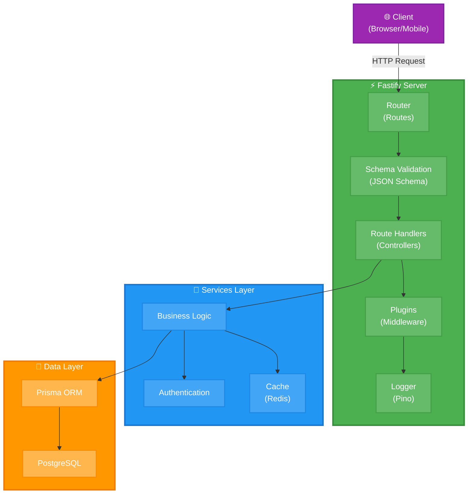

[← Оглавление курса](index.md)

---

# Глава 5. Node.js: современная разработка

## 5.1. Node.js 26 LTS: что нового

**Node.js** — JavaScript runtime, построенный на движке V8 от Google Chrome, для выполнения JavaScript на сервере.

**Ключевые характеристики:**
- **Асинхронность** — неблокирующий I/O
- **Event-driven** — событийно-ориентированная архитектура
- **NPM** — крупнейший пакетный менеджер
- **Cross-platform** — работает везде
- **Performance** — высокая производительность

**Где применяется:**
- REST API и GraphQL серверы
- Микросервисы
- Real-time приложения (WebSocket, SSE)
- CLI инструменты
- Serverless функции
- Build tools (Webpack, Vite)

**Почему в этом курсе:**
- Стандарт для современного backend
- Отличная экосистема
- TypeScript поддержка
- Легкая контейнеризация
- LTS версия — долгосрочная поддержка

**Распространенность:**
- #1 для backend JavaScript/TypeScript
- Используется в 98% JS проектов
- Поддержка всех major cloud providers
- Огромное сообщество

**Node.js 26 LTS — новые возможности:**
- Улучшенная производительность V8
- Встроенная поддержка TypeScript (экспериментально)
- Улучшенный ESM (ES Modules)
- Новые API для работы с файлами
- Улучшенная безопасность
- Лучшая поддержка Web Standards

**Актуальная версия:** Node.js 26.0.0 LTS  
**Кодовое имя:** TBD  
**LTS до:** Апрель 2028

**Ссылки:**
- Официальный сайт: https://nodejs.org/
- GitHub: https://github.com/nodejs/node
- Документация: https://nodejs.org/docs/latest-v26.x/api/
- Release Schedule: https://github.com/nodejs/release#release-schedule
- Best Practices: https://github.com/goldbergyoni/nodebestpractices

---

## 5.2. Установка Node.js через NVM

**NVM (Node Version Manager)** — инструмент для управления несколькими версиями Node.js.

**Почему NVM:**
- Легкое переключение между версиями
- Изоляция проектов
- Не требует sudo для установки пакетов
- Поддержка .nvmrc файлов

### Установка NVM

```bash
# Скачивание и установка NVM
curl -o- https://raw.githubusercontent.com/nvm-sh/nvm/v0.39.7/install.sh | bash

# Перезагрузка shell конфигурации
source ~/.bashrc

# Проверка установки
nvm --version
# Вывод: 0.39.7
```

### Установка Node.js 26 LTS

```bash
# Просмотр доступных версий
nvm list-remote | grep "v26"

# Установка Node.js 26 LTS
nvm install 26

# Установка как версию по умолчанию
nvm alias default 26

# Проверка установленной версии
node --version
# Вывод: v26.0.0

npm --version
# Вывод: 10.x.x
```

### Управление версиями

```bash
# Список установленных версий
nvm list

# Использование конкретной версии
nvm use 26

# Установка нескольких версий
nvm install 20
nvm install 22

# Переключение между версиями
nvm use 20
nvm use 26

# Удаление версии
nvm uninstall 20
```

### Настройка .nvmrc для проекта

```bash
# Создание .nvmrc файла
echo "26" > .nvmrc

# Автоматическое использование версии из .nvmrc
nvm use
# Вывод: Found '.nvmrc' with version <26>
# Now using node v26.0.0
```

---

## 5.3. Создание простого API на Fastify

**Fastify** — быстрый и низкоуровневый web framework для Node.js.

**Архитектура Fastify приложения:**



**Почему Fastify:**
- **Производительность** — один из самых быстрых фреймворков
- **Schema-based** — валидация через JSON Schema
- **TypeScript** — отличная поддержка типов
- **Плагины** — модульная архитектура
- **Логирование** — встроенный Pino logger

**Актуальная версия:** Fastify 5.2.0

**Ссылки:**
- Официальный сайт: https://fastify.dev/
- GitHub: https://github.com/fastify/fastify
- Документация: https://fastify.dev/docs/latest/

### Создание проекта

```bash
# Создание директории проекта
mkdir ~/fastify-api && cd ~/fastify-api

# Инициализация npm проекта
npm init -y

# Установка зависимостей
npm install fastify@5.2.0

# Установка dev зависимостей
npm install --save-dev typescript @types/node tsx

# Инициализация TypeScript
npx tsc --init
```

### Настройка TypeScript

**Документация:** https://www.typescriptlang.org/docs/handbook/tsconfig-json.html

```bash
# Редактирование tsconfig.json
nano tsconfig.json
```

Содержимое:

```json
{
  "compilerOptions": {
    "target": "ES2022",
    "module": "ESNext",
    "moduleResolution": "node",
    "lib": ["ES2022"],
    "outDir": "./dist",
    "rootDir": "./src",
    "strict": true,
    "esModuleInterop": true,
    "skipLibCheck": true,
    "forceConsistentCasingInFileNames": true,
    "resolveJsonModule": true
  },
  "include": ["src/**/*"],
  "exclude": ["node_modules", "dist"]
}
```

### Создание простого API

**Документация:** https://fastify.dev/docs/latest/

```bash
# Создание директории для исходников
mkdir src

# Создание основного файла
nano src/server.ts
```

Содержимое `src/server.ts`:

```typescript
import Fastify from 'fastify';

const fastify = Fastify({
  logger: true
});

// Простой GET endpoint
fastify.get('/', async (request, reply) => {
  return { message: 'Hello from Fastify!' };
});

// GET endpoint с параметром
fastify.get('/users/:id', async (request, reply) => {
  const { id } = request.params as { id: string };
  return { 
    id, 
    name: 'John Doe',
    email: 'john@example.com'
  };
});

// POST endpoint
fastify.post('/users', async (request, reply) => {
  const body = request.body as { name: string; email: string };
  return {
    id: Math.random().toString(36).substr(2, 9),
    ...body,
    createdAt: new Date().toISOString()
  };
});

// Health check endpoint
fastify.get('/health', async (request, reply) => {
  return { 
    status: 'ok',
    timestamp: new Date().toISOString(),
    uptime: process.uptime()
  };
});

// Запуск сервера
const start = async () => {
  try {
    await fastify.listen({ 
      port: 3001, 
      host: '0.0.0.0' 
    });
    console.log('Server is running on http://localhost:3001');
  } catch (err) {
    fastify.log.error(err);
    process.exit(1);
  }
};

start();
```

### Настройка package.json

**Документация:** https://docs.npmjs.com/cli/v10/configuring-npm/package-json

```bash
nano package.json
```

Добавьте scripts:

```json
{
  "name": "fastify-api",
  "version": "1.0.0",
  "type": "module",
  "scripts": {
    "dev": "tsx watch src/server.ts",
    "build": "tsc",
    "start": "node dist/server.js"
  },
  "dependencies": {
    "fastify": "^5.2.0"
  },
  "devDependencies": {
    "@types/node": "^20.10.0",
    "tsx": "^4.7.0",
    "typescript": "^5.3.3"
  }
}
```

### Запуск и тестирование

```bash
# Запуск в dev режиме
npm run dev

# В другом терминале - тестирование
curl http://localhost:3001/
# Вывод: {"message":"Hello from Fastify!"}

curl http://localhost:3001/users/123
# Вывод: {"id":"123","name":"John Doe","email":"john@example.com"}

curl -X POST http://localhost:3001/users \
  -H "Content-Type: application/json" \
  -d '{"name":"Jane","email":"jane@example.com"}'

curl http://localhost:3001/health
# Вывод: {"status":"ok","timestamp":"...","uptime":...}
```

---

## 5.4. Контейнеризация Node.js приложения

### Создание Dockerfile

**Документация:** https://docs.docker.com/engine/reference/builder/

```bash
nano Dockerfile
```

Содержимое:

```dockerfile
FROM docker.io/library/node:26-alpine

# Установка рабочей директории
WORKDIR /app

# Копирование package файлов
COPY package*.json ./

# Установка зависимостей
RUN npm ci --only=production

# Копирование исходного кода
COPY . .

# Сборка TypeScript
RUN npm run build

# Открытие порта
EXPOSE 3001

# Запуск приложения
CMD ["node", "dist/server.js"]
```

### Создание .dockerignore

```bash
nano .dockerignore
```

Содержимое:

```
node_modules
npm-debug.log
dist
.git
.gitignore
README.md
.env
.env.local
```

### Сборка и запуск

```bash
# Сборка образа
podman build -t fastify-api:1.0 .

# Проверка образа
podman images | grep fastify-api

# Запуск контейнера
podman run -d \
  --name fastify-api \
  -p 3001:3001 \
  fastify-api:1.0

# Проверка логов
podman logs fastify-api

# Тестирование
curl http://localhost:3001/health

# Остановка и удаление
podman stop fastify-api
podman rm fastify-api
```

---

## 5.5. Multi-stage builds для оптимизации

**Multi-stage builds** позволяют создавать оптимизированные образы, разделяя процесс сборки и runtime.

### Оптимизированный Dockerfile

**Документация:** https://docs.docker.com/build/building/multi-stage/

```bash
nano Dockerfile.optimized
```

Содержимое:

```dockerfile
# ============================================
# Stage 1: Build - сборка приложения
# ============================================
# Базовый образ для сборки (alpine = минимальный размер ~40MB)
# Альтернативы: node:26-slim (~180MB), node:26 (~1GB)
FROM docker.io/library/node:26-alpine AS builder

# Рабочая директория внутри контейнера
# Все последующие команды выполняются здесь
WORKDIR /app

# Копирование package файлов ОТДЕЛЬНО для кэширования слоя
# Docker кэширует этот слой, если файлы не изменились
COPY package*.json ./

# Установка ВСЕХ зависимостей (включая devDependencies)
# npm ci = clean install (быстрее и надежнее чем npm install)
# Требует наличия package-lock.json
RUN npm ci

# Копирование исходного кода
# Выполняется после установки зависимостей для лучшего кэширования
COPY . .

# Сборка TypeScript в JavaScript
# Результат в директории dist/
RUN npm run build

# ============================================
# Stage 2: Production - финальный образ
# ============================================
# Новый чистый образ без dev зависимостей
FROM docker.io/library/node:26-alpine

# Создание non-root пользователя для безопасности
# -g 1001 = GID группы, -S = системная группа
# -u 1001 = UID пользователя, -S = системный пользователь
# Запуск от root = security risk!
RUN addgroup -g 1001 -S nodejs && \
    adduser -S nodejs -u 1001

WORKDIR /app

# Копирование package файлов
COPY package*.json ./

# Установка ТОЛЬКО production зависимостей
# --only=production = без devDependencies (меньше размер)
# npm cache clean = очистка кэша для уменьшения размера
RUN npm ci --only=production && \
    npm cache clean --force

# Копирование собранного кода из builder stage
# --from=builder = из первого stage
# --chown=nodejs:nodejs = установка владельца файлов
COPY --from=builder --chown=nodejs:nodejs /app/dist ./dist

# Переключение на non-root пользователя
# Все последующие команды выполняются от этого пользователя
USER nodejs

# Открытие порта (документация, не открывает реально)
# Реальный проброс через docker run -p или compose ports
EXPOSE 3001

# Health check для мониторинга состояния
# --interval=30s = проверка каждые 30 секунд
# --timeout=3s = таймаут на выполнение
# --start-period=5s = grace period после старта
# --retries=3 = количество неудачных попыток
HEALTHCHECK --interval=30s --timeout=3s --start-period=5s --retries=3 \
  CMD node -e "require('http').get('http://localhost:3001/health', (r) => {process.exit(r.statusCode === 200 ? 0 : 1)})"

# Команда запуска (PID 1 в контейнере)
# Используем exec form (JSON array) для правильной обработки сигналов
# Альтернатива: CMD npm start (но медленнее и не обрабатывает сигналы)
CMD ["node", "dist/server.js"]
```

### Сравнение размеров

```bash
# Сборка обычного образа
podman build -t fastify-api:simple -f Dockerfile .

# Сборка оптимизированного образа
podman build -t fastify-api:optimized -f Dockerfile.optimized .

# Сравнение размеров
podman images | grep fastify-api
# fastify-api  simple      ...  250MB
# fastify-api  optimized   ...  150MB  (экономия ~40%)
```

### Запуск оптимизированного контейнера

```bash
# Запуск с health check
podman run -d \
  --name fastify-api-opt \
  -p 3001:3001 \
  --health-cmd="curl -f http://localhost:3001/health || exit 1" \
  --health-interval=30s \
  --health-timeout=3s \
  --health-retries=3 \
  fastify-api:optimized

# Проверка health status
podman inspect fastify-api-opt | grep -A 10 Health

# Просмотр логов
podman logs -f fastify-api-opt
```

---

## 5.6. Интеграция с Podman Compose

### Создание docker-compose.yml

**Документация:** https://github.com/compose-spec/compose-spec/blob/master/spec.md

```bash
nano docker-compose.yml
```

Содержимое:

```yaml
version: '3.8'

services:
  api:
    build:
      context: .
      dockerfile: Dockerfile.optimized
    image: fastify-api:latest
    container_name: fastify-api
    ports:
      - "3001:3001"
    environment:
      - NODE_ENV=production
      - PORT=3001
    restart: unless-stopped
    healthcheck:
      test: ["CMD", "node", "-e", "require('http').get('http://localhost:3001/health', (r) => {process.exit(r.statusCode === 200 ? 0 : 1)})"]
      interval: 30s
      timeout: 3s
      retries: 3
      start_period: 5s
    networks:
      - app-network

networks:
  app-network:
    driver: bridge
```

### Управление через Compose

```bash
# Сборка и запуск
podman-compose up -d --build

# Просмотр логов
podman-compose logs -f api

# Проверка статуса
podman-compose ps

# Остановка
podman-compose stop

# Удаление
podman-compose down

# Удаление с образами
podman-compose down --rmi all
```

---

**Практическое задание:**

1. Установите Node.js 26 через NVM
2. Создайте Fastify API с 5+ endpoints
3. Добавьте TypeScript
4. Создайте Dockerfile с multi-stage build
5. Соберите и запустите контейнер
6. Настройте docker-compose.yml
7. Проверьте health checks

**Проверка знаний:**

```bash
# Какая версия Node.js установлена?
node --version

# Какой размер образа?
podman images | grep fastify-api

# Работает ли health check?
podman inspect fastify-api-opt | grep -A 5 Health

# Сколько памяти использует контейнер?
podman stats fastify-api-opt --no-stream
```

---

**Навигация:**
- [← Вернуться к содержанию](index.md)
- [← Глава 4: Komodo: управление инфраструктурой и деплоем](chapter-04-comodo.md)
- [→ Глава 6: Vite: современный фронтенд](chapter-06-vite.md)
