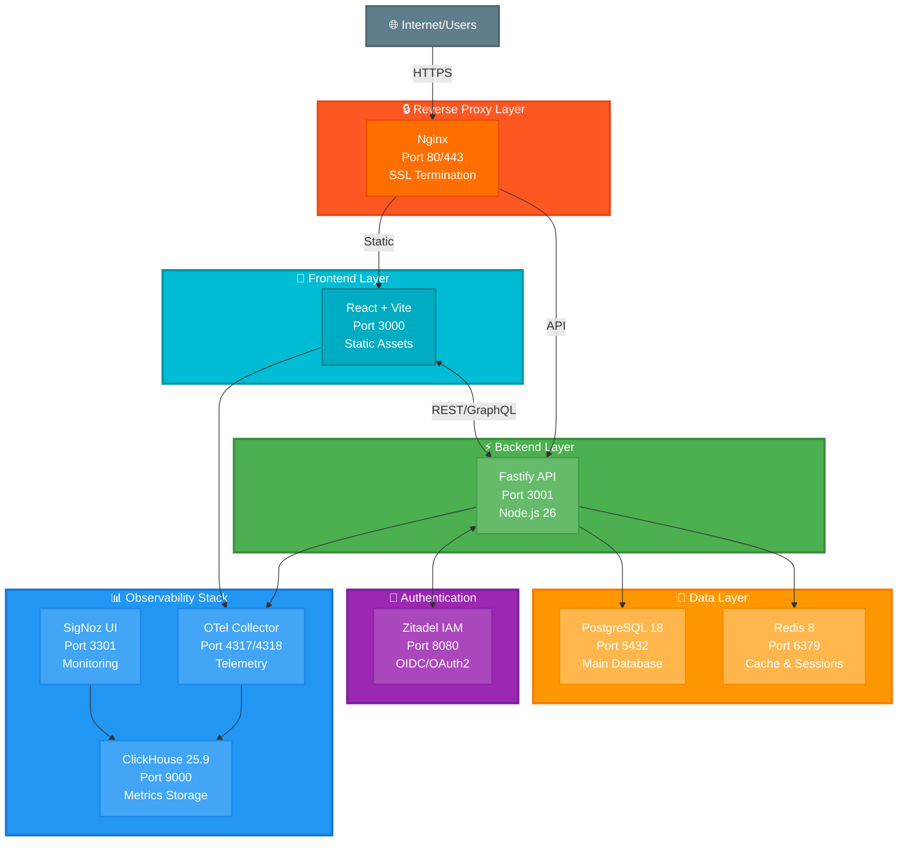

[← Оглавление курса](index.md)


# Глава 10. Интеграция всех компонентов

## 10.1. Архитектура финального решения

### Обзор системы



### Компоненты стека

| Компонент | Порт | Назначение |
|-----------|------|------------|
| Nginx | 80, 443 | Reverse proxy, SSL |
| React Frontend | 3000 | UI приложения |
| Fastify API | 3001 | Backend API |
| PostgreSQL | 5432 | Основная БД |
| Redis | 6379 | Кэш и сессии |
| Zitadel | 8080 | Аутентификация |
| SigNoz | 3301 | Мониторинг UI |
| OTel Collector | 4317, 4318 | Сбор телеметрии |
| ClickHouse | 9000 | Хранилище метрик |


## 10.2. Podman Compose для всего стека

### Создание полного docker-compose.yml

**Документация:** https://github.com/compose-spec/compose-spec/blob/master/spec.md

```bash
mkdir -p ~/eventbrain-stack && cd ~/eventbrain-stack
nano docker-compose.yml
```

Содержимое:

```yaml
# Версия спецификации Compose
# Опции: '3.8', '3.9' (рекомендуется 3.8 для совместимости)
version: '3.8'

services:
  # PostgreSQL - основная БД
  postgres:
    # Образ: postgres:18-alpine (alpine = минимальный размер)
    # Альтернативы: postgres:18, postgres:18-bullseye
    image: postgres:18-alpine
    
    # Имя контейнера (опционально, но удобно для логов)
    container_name: eventbrain-postgres
    
    # Переменные окружения
    # ${VAR:-default} = использовать VAR из .env или default
    environment:
      # Имя пользователя БД
      POSTGRES_USER: ${POSTGRES_USER:-developer}
      # Пароль (ОБЯЗАТЕЛЬНО изменить в production!)
      POSTGRES_PASSWORD: ${POSTGRES_PASSWORD:-secret123}
      # Имя базы данных
      POSTGRES_DB: ${POSTGRES_DB:-eventbrain}
    
    # Volumes для персистентности данных
    volumes:
      # Named volume для данных БД (управляется Docker)
      - postgres-data:/var/lib/postgresql/data
      # Bind mount для init скриптов (ro = read-only)
      # Скрипты выполняются при первом запуске
      - ./init-scripts:/docker-entrypoint-initdb.d:ro
    
    # Проброс портов: "host:container"
    # Опции: "5432:5432" (доступен извне), без пробросов (только внутри сети)
    ports:
      - "5432:5432"
    
    # Health check для проверки готовности
    healthcheck:
      # Команда проверки (pg_isready проверяет доступность PostgreSQL)
      test: ["CMD-SHELL", "pg_isready -U ${POSTGRES_USER:-developer}"]
      # Интервал между проверками
      interval: 10s
      # Таймаут на выполнение команды
      timeout: 5s
      # Количество неудачных попыток до признания unhealthy
      retries: 5
    
    # Сети для взаимодействия с другими контейнерами
    # backend = внутренняя сеть для БД и API
    networks:
      - backend
    
    # Политика перезапуска
    # Опции: no, always, on-failure, unless-stopped
    restart: unless-stopped

  # Redis - кэш и сессии
  redis:
    image: redis:8.2-alpine
    container_name: eventbrain-redis
    command: redis-server --appendonly yes
    volumes:
      - redis-data:/data
    ports:
      - "6379:6379"
    healthcheck:
      test: ["CMD", "redis-cli", "ping"]
      interval: 10s
      timeout: 3s
      retries: 3
    networks:
      - backend
    restart: unless-stopped

  # Zitadel PostgreSQL
  zitadel-db:
    image: postgres:18-alpine
    container_name: zitadel-db
    environment:
      POSTGRES_USER: zitadel
      POSTGRES_PASSWORD: ${ZITADEL_DB_PASSWORD:-zitadel_secret}
      POSTGRES_DB: zitadel
    volumes:
      - zitadel-db-data:/var/lib/postgresql/data
    healthcheck:
      test: ["CMD-SHELL", "pg_isready -U zitadel"]
      interval: 10s
      timeout: 5s
      retries: 5
    networks:
      - backend
    restart: unless-stopped

  # Zitadel IAM
  zitadel:
    image: ghcr.io/zitadel/zitadel:v4.3.0
    container_name: zitadel
    command: 'start-from-init --masterkeyFromEnv --tlsMode disabled'
    environment:
      - ZITADEL_DATABASE_POSTGRES_HOST=zitadel-db
      - ZITADEL_DATABASE_POSTGRES_PORT=5432
      - ZITADEL_DATABASE_POSTGRES_DATABASE=zitadel
      - ZITADEL_DATABASE_POSTGRES_USER_USERNAME=zitadel
      - ZITADEL_DATABASE_POSTGRES_USER_PASSWORD=${ZITADEL_DB_PASSWORD:-zitadel_secret}
      - ZITADEL_DATABASE_POSTGRES_USER_SSL_MODE=disable
      - ZITADEL_DATABASE_POSTGRES_ADMIN_USERNAME=zitadel
      - ZITADEL_DATABASE_POSTGRES_ADMIN_PASSWORD=${ZITADEL_DB_PASSWORD:-zitadel_secret}
      - ZITADEL_DATABASE_POSTGRES_ADMIN_SSL_MODE=disable
      - ZITADEL_EXTERNALSECURE=false
      - ZITADEL_EXTERNALPORT=8080
      - ZITADEL_EXTERNALDOMAIN=localhost
      - ZITADEL_MASTERKEY=${ZITADEL_MASTERKEY:-MasterkeyNeedsToHave32Characters}
    ports:
      - "8080:8080"
    depends_on:
      zitadel-db:
        condition: service_healthy
    networks:
      - backend
      - frontend
    restart: unless-stopped

  # ClickHouse - хранилище метрик
  clickhouse:
    image: clickhouse/clickhouse-server:25.9-alpine
    container_name: signoz-clickhouse
    volumes:
      - clickhouse-data:/var/lib/clickhouse/
    ports:
      - "9000:9000"
      - "8123:8123"
    healthcheck:
      test: ["CMD", "wget", "--spider", "-q", "localhost:8123/ping"]
      interval: 30s
      timeout: 5s
      retries: 3
    networks:
      - backend
    restart: unless-stopped

  # OTel Collector
  otel-collector:
    image: signoz/signoz-otel-collector:0.96.1
    container_name: signoz-otel-collector
    command: ["--config=/etc/otel-collector-config.yaml"]
    volumes:
      - ./otel-collector-config.yaml:/etc/otel-collector-config.yaml:ro
    ports:
      - "4317:4317"
      - "4318:4318"
    depends_on:
      clickhouse:
        condition: service_healthy
    networks:
      - backend
    restart: unless-stopped

  # SigNoz Query Service
  query-service:
    image: signoz/query-service:0.96.1
    container_name: signoz-query-service
    environment:
      - ClickHouseUrl=tcp://clickhouse:9000
      - STORAGE=clickhouse
    ports:
      - "8081:8080"
    depends_on:
      clickhouse:
        condition: service_healthy
    networks:
      - backend
    restart: unless-stopped

  # SigNoz Frontend
  signoz-frontend:
    image: signoz/frontend:0.96.1
    container_name: signoz-frontend
    environment:
      - FRONTEND_API_ENDPOINT=http://query-service:8080
    ports:
      - "3301:3301"
    depends_on:
      - query-service
    networks:
      - frontend
    restart: unless-stopped

  # Fastify API
  api:
    build:
      context: ./api
      dockerfile: Dockerfile
    container_name: eventbrain-api
    environment:
      - NODE_ENV=production
      - DATABASE_URL=postgresql://${POSTGRES_USER:-developer}:${POSTGRES_PASSWORD:-secret123}@postgres:5432/${POSTGRES_DB:-eventbrain}
      - REDIS_URL=redis://redis:6379
      - ZITADEL_ISSUER=http://zitadel:8080
      - ZITADEL_CLIENT_ID=${ZITADEL_CLIENT_ID}
      - ZITADEL_CLIENT_SECRET=${ZITADEL_CLIENT_SECRET}
      - OTEL_EXPORTER_OTLP_ENDPOINT=http://otel-collector:4318
      - SERVICE_NAME=eventbrain-api
    ports:
      - "3001:3001"
    depends_on:
      postgres:
        condition: service_healthy
      redis:
        condition: service_healthy
      zitadel:
        condition: service_started
      otel-collector:
        condition: service_started
    networks:
      - backend
      - frontend
    healthcheck:
      test: ["CMD", "wget", "--spider", "-q", "localhost:3001/health"]
      interval: 30s
      timeout: 3s
      retries: 3
    restart: unless-stopped

  # React Frontend
  frontend:
    build:
      context: ./frontend
      dockerfile: Dockerfile
    container_name: eventbrain-frontend
    ports:
      - "3000:80"
    depends_on:
      api:
        condition: service_healthy
    networks:
      - frontend
    healthcheck:
      test: ["CMD", "wget", "--spider", "-q", "localhost/health"]
      interval: 30s
      timeout: 3s
      retries: 3
    restart: unless-stopped

  # Nginx Reverse Proxy
  nginx:
    image: nginx:alpine
    container_name: eventbrain-nginx
    volumes:
      - ./nginx.conf:/etc/nginx/nginx.conf:ro
    ports:
      - "80:80"
    depends_on:
      - frontend
      - api
    networks:
      - frontend
    restart: unless-stopped

networks:
  frontend:
    driver: bridge
  backend:
    driver: bridge

volumes:
  postgres-data:
  redis-data:
  zitadel-db-data:
  clickhouse-data:
```

### Создание .env файла

**Документация:** https://docs.docker.com/compose/environment-variables/

```bash
nano .env
```

Содержимое:

```env
# PostgreSQL
POSTGRES_USER=developer
POSTGRES_PASSWORD=strong_password_here
POSTGRES_DB=eventbrain

# Zitadel
ZITADEL_DB_PASSWORD=zitadel_strong_password
ZITADEL_MASTERKEY=MasterkeyNeedsToHave32Characters
ZITADEL_CLIENT_ID=your_client_id_from_zitadel
ZITADEL_CLIENT_SECRET=your_client_secret_from_zitadel
```


## 10.3. Сетевое взаимодействие контейнеров

### Создание сетей

```bash
# Frontend network - для публичных сервисов
podman network create frontend

# Backend network - для внутренних сервисов
podman network create backend
```

### Правила взаимодействия

**Frontend network:**
- Nginx
- React Frontend
- Fastify API (публичный интерфейс)
- Zitadel (публичный интерфейс)
- SigNoz Frontend

**Backend network:**
- Fastify API (внутренний интерфейс)
- PostgreSQL
- Redis
- Zitadel (внутренний интерфейс)
- ClickHouse
- OTel Collector

### Проверка сетевого взаимодействия

```bash
# Проверка DNS resolution
podman exec eventbrain-api ping -c 1 postgres
podman exec eventbrain-api ping -c 1 redis
podman exec eventbrain-api ping -c 1 zitadel

# Проверка портов
podman exec eventbrain-api nc -zv postgres 5432
podman exec eventbrain-api nc -zv redis 6379
```


## 10.4. Управление секретами

### Использование Podman secrets

```bash
# Создание секретов
echo "strong_password_here" | podman secret create postgres_password -
echo "zitadel_strong_password" | podman secret create zitadel_password -

# Список секретов
podman secret ls

# Использование в compose
```

Обновленный docker-compose.yml:

```yaml
services:
  postgres:
    secrets:
      - postgres_password
    environment:
      POSTGRES_PASSWORD_FILE: /run/secrets/postgres_password

secrets:
  postgres_password:
    external: true
  zitadel_password:
    external: true
```

### Переменные окружения

```bash
# Создание .env.production
nano .env.production
```

Содержимое:

```env
NODE_ENV=production
LOG_LEVEL=info
API_RATE_LIMIT=100
SESSION_TIMEOUT=3600
```


## 10.5. CI/CD с GitLab

### Создание .gitlab-ci.yml

**Документация:** https://docs.gitlab.com/ee/ci/yaml/

```yaml
stages:
  - test
  - build
  - deploy

variables:
  REGISTRY: registry.gitlab.com
  IMAGE_TAG: $CI_COMMIT_SHORT_SHA

# Test stage
test:api:
  stage: test
  image: node:26-alpine
  script:
    - cd api
    - npm ci
    - npm run test
    - npm run lint
  only:
    - merge_requests
    - main

test:frontend:
  stage: test
  image: node:26-alpine
  script:
    - cd frontend
    - npm ci
    - npm run test
    - npm run lint
  only:
    - merge_requests
    - main

# Build stage
build:api:
  stage: build
  image: quay.io/podman/stable
  script:
    - cd api
    - podman build -t $REGISTRY/$CI_PROJECT_PATH/api:$IMAGE_TAG .
    - podman push $REGISTRY/$CI_PROJECT_PATH/api:$IMAGE_TAG
  only:
    - main

build:frontend:
  stage: build
  image: quay.io/podman/stable
  script:
    - cd frontend
    - podman build -t $REGISTRY/$CI_PROJECT_PATH/frontend:$IMAGE_TAG .
    - podman push $REGISTRY/$CI_PROJECT_PATH/frontend:$IMAGE_TAG
  only:
    - main

# Deploy stage
deploy:production:
  stage: deploy
  image: alpine:latest
  before_script:
    - apk add --no-cache openssh-client
    - eval $(ssh-agent -s)
    - echo "$SSH_PRIVATE_KEY" | tr -d '\r' | ssh-add -
  script:
    - ssh $DEPLOY_USER@$DEPLOY_HOST "cd /opt/eventbrain && podman-compose pull && podman-compose up -d"
  only:
    - main
  when: manual
```

### Настройка GitLab Runner

```bash
# Установка GitLab Runner
sudo dnf install -y gitlab-runner

# Регистрация runner
sudo gitlab-runner register \
  --url https://gitlab.com/ \
  --registration-token YOUR_TOKEN \
  --executor shell \
  --description "AlmaLinux Podman Runner"
```


**Практическое задание:**

1. Создайте полный docker-compose.yml со всеми сервисами
2. Настройте сети frontend и backend
3. Настройте управление секретами
4. Запустите весь стек
5. Проверьте взаимодействие всех компонентов
6. Настройте CI/CD pipeline
7. Выполните тестовый deploy

**Проверка знаний:**

```bash
# Все ли сервисы запущены?
podman-compose ps

# Работают ли health checks?
podman ps --format "{{.Names}}: {{.Status}}"

# Доступны ли все endpoints?
curl http://localhost/health
curl http://localhost:3001/health
curl http://localhost:8080/debug/healthz
curl http://localhost:3301

# Работает ли сетевое взаимодействие?
podman exec eventbrain-api ping -c 1 postgres
```


