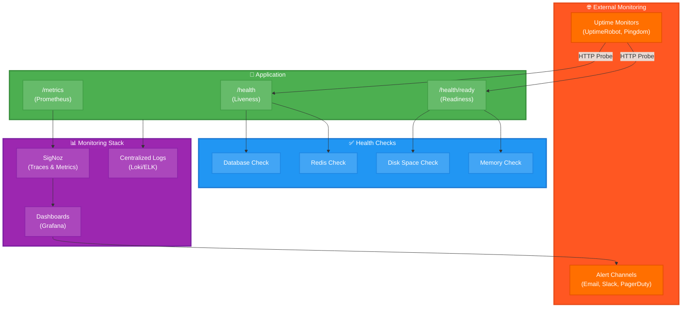

[← Оглавление курса](index.md)

---

# Глава 12. Production-ready практики

## 12.1. Логирование и ротация логов

### Настройка структурированного логирования

**Fastify с Pino logger:**

```typescript
// src/logger.ts
import pino from 'pino';

export const logger = pino({
  level: process.env.LOG_LEVEL || 'info',
  formatters: {
    level: (label) => {
      return { level: label };
    },
  },
  timestamp: pino.stdTimeFunctions.isoTime,
  serializers: {
    req: (req) => ({
      method: req.method,
      url: req.url,
      headers: req.headers,
      remoteAddress: req.ip,
    }),
    res: (res) => ({
      statusCode: res.statusCode,
    }),
  },
});

// src/server.ts
const fastify = Fastify({
  logger: logger,
  requestIdLogLabel: 'requestId',
  disableRequestLogging: false,
});
```

### Ротация логов с logrotate

**Документация:** https://linux.die.net/man/8/logrotate

```bash
# Создание конфигурации logrotate
sudo nano /etc/logrotate.d/eventbrain
```

Содержимое:

```
/var/log/eventbrain/*.log {
    daily
    rotate 14
    compress
    delaycompress
    notifempty
    create 0640 developer developer
    sharedscripts
    postrotate
        podman kill -s USR1 eventbrain-api
    endscript
}
```

### Централизованное логирование

```yaml
# docker-compose.logging.yml
services:
  loki:
    image: grafana/loki:latest
    ports:
      - "3100:3100"
    volumes:
      - loki-data:/loki
    command: -config.file=/etc/loki/local-config.yaml

  promtail:
    image: grafana/promtail:latest
    volumes:
      - /var/log:/var/log:ro
      - ./promtail-config.yaml:/etc/promtail/config.yaml
    command: -config.file=/etc/promtail/config.yaml

volumes:
  loki-data:
```

---

## 12.2. Health checks и мониторинг

**Архитектура мониторинга в Production:**



### Комплексный health check endpoint

```typescript
// src/routes/health.ts
import { FastifyInstance } from 'fastify';
import { prisma } from '../db.js';
import { redis } from '../redis.js';

export async function healthRoutes(fastify: FastifyInstance) {
  // Простой health check
  fastify.get('/health', async (request, reply) => {
    return { status: 'ok', timestamp: new Date().toISOString() };
  });

  // Детальный health check
  fastify.get('/health/detailed', async (request, reply) => {
    const checks = {
      status: 'ok',
      timestamp: new Date().toISOString(),
      uptime: process.uptime(),
      checks: {
        database: 'unknown',
        redis: 'unknown',
        memory: 'unknown',
      },
    };

    // Проверка PostgreSQL
    try {
      await prisma.$queryRaw`SELECT 1`;
      checks.checks.database = 'healthy';
    } catch (error) {
      checks.checks.database = 'unhealthy';
      checks.status = 'degraded';
    }

    // Проверка Redis
    try {
      await redis.ping();
      checks.checks.redis = 'healthy';
    } catch (error) {
      checks.checks.redis = 'unhealthy';
      checks.status = 'degraded';
    }

    // Проверка памяти
    const memUsage = process.memoryUsage();
    const memLimit = 512 * 1024 * 1024; // 512MB
    if (memUsage.heapUsed < memLimit * 0.9) {
      checks.checks.memory = 'healthy';
    } else {
      checks.checks.memory = 'warning';
      checks.status = 'degraded';
    }

    const statusCode = checks.status === 'ok' ? 200 : 503;
    reply.code(statusCode);
    return checks;
  });

  // Readiness probe
  fastify.get('/ready', async (request, reply) => {
    try {
      await prisma.$queryRaw`SELECT 1`;
      return { ready: true };
    } catch (error) {
      reply.code(503);
      return { ready: false };
    }
  });

  // Liveness probe
  fastify.get('/live', async (request, reply) => {
    return { alive: true };
  });
}
```

### Мониторинг с Prometheus

```typescript
// src/metrics.ts
import promClient from 'prom-client';

const register = new promClient.Registry();

// Default metrics
promClient.collectDefaultMetrics({ register });

// Custom metrics
export const httpRequestDuration = new promClient.Histogram({
  name: 'http_request_duration_seconds',
  help: 'Duration of HTTP requests in seconds',
  labelNames: ['method', 'route', 'status_code'],
  registers: [register],
});

export const httpRequestTotal = new promClient.Counter({
  name: 'http_requests_total',
  help: 'Total number of HTTP requests',
  labelNames: ['method', 'route', 'status_code'],
  registers: [register],
});

// Metrics endpoint
fastify.get('/metrics', async (request, reply) => {
  reply.type('text/plain');
  return register.metrics();
});
```

---

## 12.3. Backup-стратегия

### Автоматический backup PostgreSQL

**Документация:** https://www.postgresql.org/docs/18/backup.html

```bash
nano /usr/local/bin/backup-eventbrain.sh
```

Содержимое:

```bash
#!/bin/bash

set -e

BACKUP_DIR="/backup/eventbrain"
DATE=$(date +%Y%m%d_%H%M%S)
RETENTION_DAYS=30

mkdir -p $BACKUP_DIR

# PostgreSQL backup
podman exec eventbrain-postgres pg_dump -U developer -Fc eventbrain > \
  $BACKUP_DIR/postgres_${DATE}.dump

# Redis backup
podman exec eventbrain-redis redis-cli SAVE
podman cp eventbrain-redis:/data/dump.rdb $BACKUP_DIR/redis_${DATE}.rdb

# Zitadel backup
podman exec zitadel-db pg_dump -U zitadel -Fc zitadel > \
  $BACKUP_DIR/zitadel_${DATE}.dump

# Compress backups
gzip $BACKUP_DIR/*_${DATE}.*

# Upload to S3 (опционально)
if [ -n "$AWS_S3_BUCKET" ]; then
  aws s3 sync $BACKUP_DIR s3://$AWS_S3_BUCKET/eventbrain/
fi

# Удаление старых backup'ов
find $BACKUP_DIR -name "*.gz" -mtime +$RETENTION_DAYS -delete

echo "Backup completed: $DATE"
```

Настройка cron:

```bash
chmod +x /usr/local/bin/backup-eventbrain.sh

# Добавление в crontab (каждый день в 2:00)
sudo crontab -e
# 0 2 * * * /usr/local/bin/backup-eventbrain.sh >> /var/log/backup.log 2>&1
```

### Восстановление из backup

```bash
nano /usr/local/bin/restore-eventbrain.sh
```

Содержимое:

```bash
#!/bin/bash

set -e

BACKUP_FILE=$1

if [ -z "$BACKUP_FILE" ]; then
  echo "Usage: $0 <backup_file>"
  exit 1
fi

# Остановка сервисов
podman-compose stop api frontend

# Восстановление PostgreSQL
gunzip -c $BACKUP_FILE | podman exec -i eventbrain-postgres \
  pg_restore -U developer -d eventbrain --clean --if-exists

# Перезапуск сервисов
podman-compose start api frontend

echo "Restore completed"
```

---

## 12.4. Обновление компонентов

### Стратегия обновления

**1. Blue-Green Deployment:**

```bash
# Запуск новой версии (green)
podman-compose -f docker-compose.green.yml up -d

# Проверка health checks
curl http://localhost:3002/health

# Переключение трафика в Nginx
# Обновите nginx.conf для проксирования на :3002

# Остановка старой версии (blue)
podman-compose -f docker-compose.blue.yml down
```

**2. Rolling Update:**

```bash
# Обновление по одному сервису
podman-compose pull api
podman-compose up -d --no-deps api

# Проверка
podman-compose ps
curl http://localhost:3001/health
```

### Скрипт безопасного обновления

```bash
nano /usr/local/bin/update-eventbrain.sh
```

Содержимое:

```bash
#!/bin/bash

set -e

echo "Starting update process..."

# Backup перед обновлением
/usr/local/bin/backup-eventbrain.sh

# Pull новых образов
podman-compose pull

# Обновление по одному сервису
for service in api frontend; do
  echo "Updating $service..."
  
  # Запуск новой версии
  podman-compose up -d --no-deps $service
  
  # Ожидание готовности
  sleep 10
  
  # Health check
  if ! curl -f http://localhost:3001/health; then
    echo "Health check failed for $service"
    echo "Rolling back..."
    podman-compose down
    # Восстановление из backup
    exit 1
  fi
  
  echo "$service updated successfully"
done

echo "Update completed successfully"
```

---

## 12.5. Troubleshooting типичных проблем

### Проблема: Контейнер не запускается

```bash
# Проверка логов
podman logs eventbrain-api

# Проверка событий
podman events --filter container=eventbrain-api

# Проверка ресурсов
podman stats eventbrain-api --no-stream

# Проверка конфигурации
podman inspect eventbrain-api | jq '.[]'
```

### Проблема: Медленная работа БД

```sql
-- Проверка активных запросов
SELECT pid, now() - query_start as duration, query
FROM pg_stat_activity
WHERE state = 'active'
ORDER BY duration DESC;

-- Проверка блокировок
SELECT * FROM pg_locks WHERE NOT granted;

-- Анализ медленных запросов
SELECT query, mean_exec_time, calls
FROM pg_stat_statements
ORDER BY mean_exec_time DESC
LIMIT 10;
```

### Проблема: Высокое использование памяти

```bash
# Проверка памяти контейнеров
podman stats --no-stream

# Ограничение памяти
podman update --memory=512m eventbrain-api

# Проверка memory leaks в Node.js
podman exec eventbrain-api node --expose-gc --inspect=0.0.0.0:9229 dist/server.js
```

### Проблема: Сетевые проблемы

```bash
# Проверка сетей
podman network ls
podman network inspect frontend

# Проверка DNS
podman exec eventbrain-api nslookup postgres

# Проверка портов
podman exec eventbrain-api netstat -tulpn

# Проверка firewall
sudo firewall-cmd --list-all
```

### Чек-лист troubleshooting

```bash
# 1. Проверка статуса всех сервисов
podman-compose ps

# 2. Проверка health checks
for port in 3001 3301 8080; do
  echo "Checking port $port..."
  curl -f http://localhost:$port/health || echo "FAILED"
done

# 3. Проверка логов
podman-compose logs --tail=50

# 4. Проверка ресурсов
podman stats --no-stream

# 5. Проверка дискового пространства
df -h

# 6. Проверка сети
podman network ls
```

---

## Финальный чек-лист production

### Безопасность

- [ ] Все пароли в секретах, не в .env
- [ ] SSL/TLS настроен
- [ ] Firewall правила настроены
- [ ] Rootless контейнеры
- [ ] Регулярные обновления безопасности
- [ ] Сканирование образов на уязвимости

### Мониторинг

- [ ] Health checks настроены
- [ ] Логирование централизовано
- [ ] Метрики собираются
- [ ] Алерты настроены
- [ ] Дашборды созданы

### Backup

- [ ] Автоматический backup настроен
- [ ] Backup тестируется регулярно
- [ ] Retention policy определена
- [ ] Offsite backup настроен

### Performance

- [ ] Resource limits установлены
- [ ] Кэширование настроено
- [ ] Database индексы оптимизированы
- [ ] CDN настроен для статики

### Документация

- [ ] Runbook создан
- [ ] Процедуры восстановления документированы
- [ ] Контакты on-call определены
- [ ] Архитектурная документация актуальна

---

**Практическое задание:**

1. Настройте структурированное логирование
2. Создайте комплексные health checks
3. Настройте автоматический backup
4. Создайте скрипт безопасного обновления
5. Протестируйте восстановление из backup
6. Настройте мониторинг и алерты
7. Создайте runbook для типичных проблем

**Проверка знаний:**

```bash
# Работают ли все health checks?
curl http://localhost:3001/health/detailed

# Создается ли backup?
ls -lh /backup/eventbrain/

# Работает ли мониторинг?
curl http://localhost:3001/metrics

# Можно ли восстановить из backup?
# Протестируйте на dev окружении
```

---

## Заключение курса

Поздравляем! Вы прошли полный курс по контейнерной разработке на AlmaLinux 9.

**Что вы освоили:**

✅ Настройка AlmaLinux 9 для разработки  
✅ Работа с Podman 5 в rootless режиме  
✅ Разработка на Node.js 26 LTS + Fastify  
✅ Современный фронтенд с Vite 6 + React  
✅ PostgreSQL 18 + Prisma ORM  
✅ Мониторинг с SigNoz + OpenTelemetry  
✅ Аутентификация с Zitadel IAM  
✅ Интеграция всех компонентов  
✅ Production-ready практики  

**Следующие шаги:**

1. **Практика** — создайте собственный проект
2. **Kubernetes** — изучите оркестрацию
3. **Terraform** — автоматизируйте инфраструктуру
4. **Security** — углубитесь в безопасность
5. **Scaling** — изучите горизонтальное масштабирование

**Полезные ресурсы:**

- [Все ресурсы курса](RESOURCES-AND-LINKS.md)
- [Главная страница](README.md)
- [Содержание курса](index.md)

**Обратная связь:**

Нашли ошибку или хотите улучшить курс? Создайте issue в репозитории!

---

---

**Успехов в разработке!** 🚀

**Версия курса:** 1.1  
**Дата завершения:** Октябрь 2025
